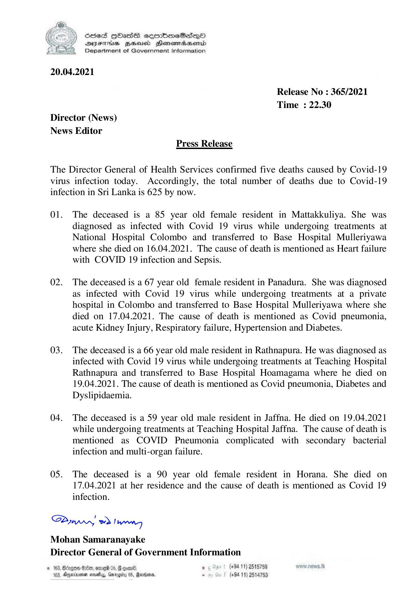

# Press Release - 2021.04.20 - Covid 19 infection deaths 
Key: 77da8de67647c7013b616344170b2e55 

---
```
NY Scdes HhasS coorbmeSedqQoO
SYsIhis Zee Henesrdaembd
Department of Government Information

 

20.04.2021

Release No : 365/2021
Time : 22.30
Director (News)
News Editor
Press Release

The Director General of Health Services confirmed five deaths caused by Covid-19
virus infection today. Accordingly, the total number of deaths due to Covid-19
infection in Sri Lanka is 625 by now.

01. The deceased is a 85 year old female resident in Mattakkuliya. She was
diagnosed as infected with Covid 19 virus while undergoing treatments at
National Hospital Colombo and transferred to Base Hospital Mulleriyawa
where she died on 16.04.2021. The cause of death is mentioned as Heart failure
with COVID 19 infection and Sepsis.

02. The deceased is a 67 year old female resident in Panadura. She was diagnosed
as infected with Covid 19 virus while undergoing treatments at a private
hospital in Colombo and transferred to Base Hospital Mulleriyawa where she
died on 17.04.2021. The cause of death is mentioned as Covid pneumonia,
acute Kidney Injury, Respiratory failure, Hypertension and Diabetes.

03. The deceased is a 66 year old male resident in Rathnapura. He was diagnosed as
infected with Covid 19 virus while undergoing treatments at Teaching Hospital
Rathnapura and transferred to Base Hospital Hoamagama where he died on
19.04.2021. The cause of death is mentioned as Covid pneumonia, Diabetes and
Dyslipidaemia.

04. The deceased is a 59 year old male resident in Jaffna. He died on 19.04.2021
while undergoing treatments at Teaching Hospital Jaffna. The cause of death is
mentioned as COVID Pneumonia complicated with secondary bacterial
infection and multi-organ failure.

05. The deceased is a 90 year old female resident in Horana. She died on
17.04.2021 at her residence and the cause of death is mentioned as Covid 19
infection.

Saw 2) wn
Mohan Samaranayake
Director General of Government Information

© 163, Borgen Oe, ome 05, @ eoar® ° (+94 11) 2515759
103, Agjeinemen mosey, Gnrggiy 0S, Maxton . (+94 11) 2514753

```
