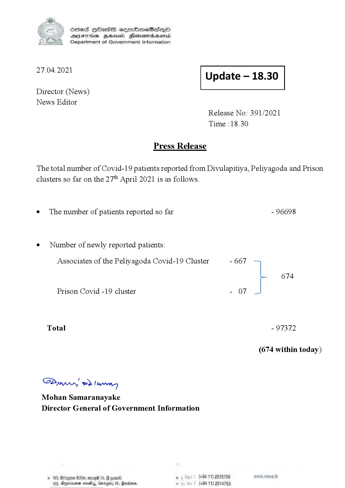

# Press Release - 2021.04.27 
Key: 781c243653d80392b94a11914f0bb772 

---
```
S) ScseS HOasdS cerrbmeSdQo
SVsThis geod Henssnadasombd
Department of Government Information

 

 

27.04.2021 Update — 18.30

 

 

 

Director (News)

News Editor
Release No: 391/2021
Time :18.30

Press Release
The total number of Covid-19 patients reported from Divulapitiya, Peliyagoda and Prison
clusters so far on the 27" April 2021 is as follows.

e The number of patients reported so far - 96698

¢ Number of newly reported patients:

Associates of the Peliyagoda Covid-19 Cluster - 667
674
Prison Covid -19 cluster - 07
Total - 97372
(674 within today)

Saw, > Inn
Mohan Samaranayake
Director General of Government Information

goad, . (+94 11) 2515789
05, Renin, - (+94 11) 2514753

© 163, Borgo $200, ome 05, @
163, Agora sosethys, Gar,

  

```
