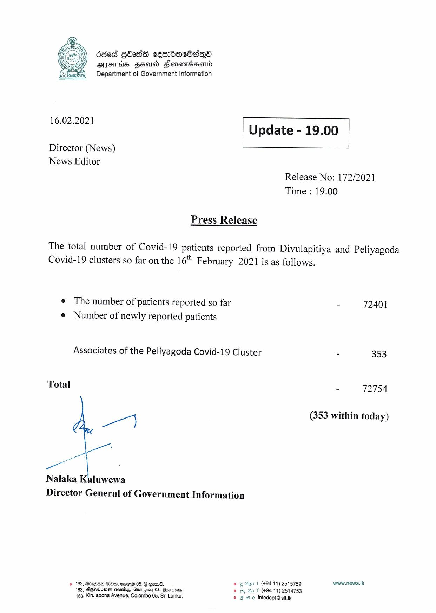

# Press Release - 2021.02.16 
Key: 7825e94e44884b46911dc8bd59a5dc8c 

---
```
6368 gOadS cesrbacSsqQo
AFIS FSA Slonomadsomd
Department of Government Information

 

 

16.02.2021 Update - 19.00

 

 

 

Director (News)
News Editor

Release No: 172/2021
Time : 19.00

Press Release

The total number of Covid-19 patients reported from Divulapitiya and Peliyagoda
Covid-19 clusters so far on the 16" February 2021 is as follows.

e The number of patients reported so far - 72401
e Number of newly reported patients

Associates of the Peliyagoda Covid-19 Cluster - 353

Total 72754

at (353 within today)

ee

Nalaka Kaluwewa
Director General of Government Information

© 163, Bczgue 28m, ome 05, § qo. © ¢ Sar t (+9411) 2515759 www.news.Ik:
163, Sqaiuesr ssuehuy, Garupiby 05, Bernina. © my Gu f (+94 11) 2514753
163, Kirulapona Avenue, Colombo 05, Sri Lanka. © 9g We infodept@sit.k

```
