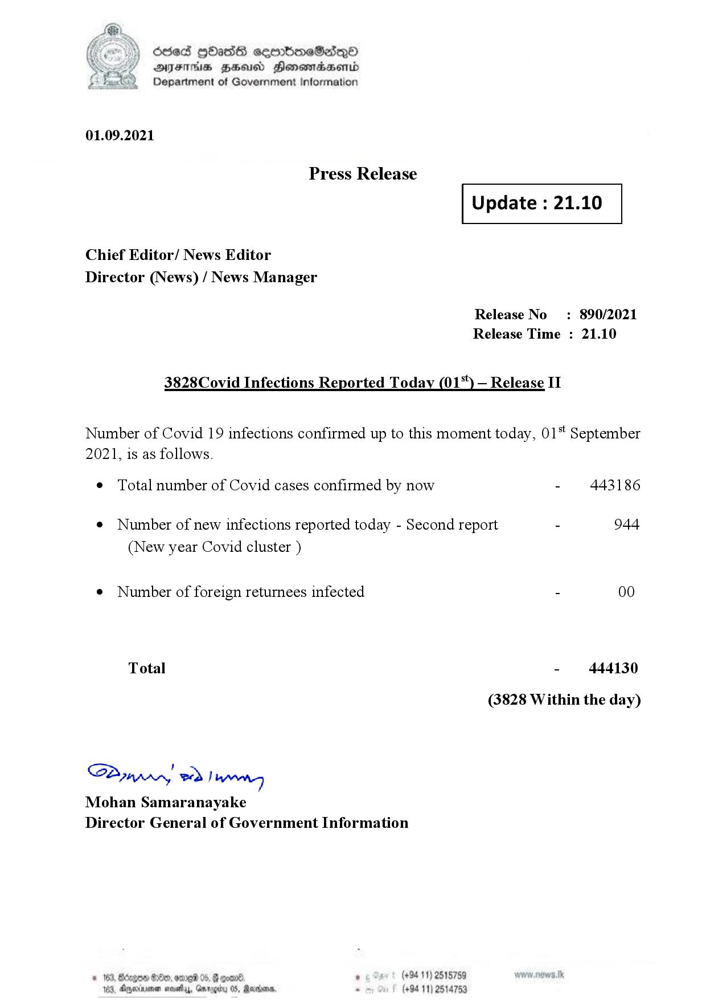

# Press Release - 2021.09.01- Covid 19 Infection Report 
Key: 78cd99b7ca1ab2fb34ffb43ccb1afd65 

---
```
dosed GOass eemmbmeSadepO
DFS BHU Honswnradasentd
Department of Government Information

 

 

01.09.2021

Press Release

Chief Editor/ News Editor
Director (News) / News Manager

 

 

Update : 21.10

 

 

Release No

: 890/2021

Release Time : 21.10

3828Covid Infections Reported Today (01%) — Release II

Number of Covid 19 infections confirmed up to this moment today, 01‘ September

2021, is as follows.

¢ Total number of Covid cases confirmed by now

¢ Number of new infections reported today - Second report -

(New year Covid cluster )

¢ Number of foreign returnees infected

Total

SPynprn wd Ing
Mohan Samaranayake
Director General of Government Information

© 163, Bicegeen Be, ome 05, @
103, Dnerisemen saves, aro

 

. (+94 11) 2515759
(+94 11) 2514753

443186

944

00

444130

(3828 Within the day)

```
