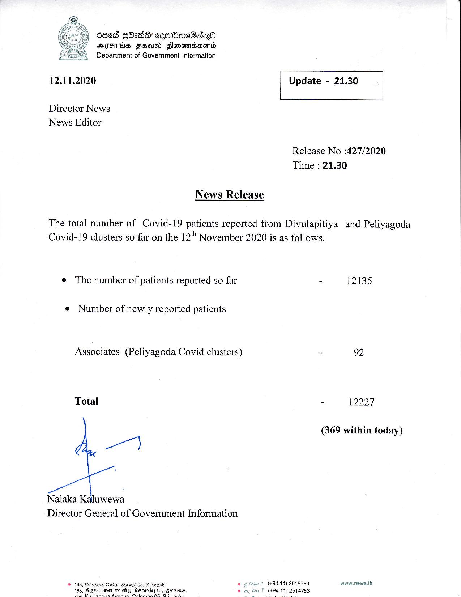

# Press Release - 2020.11.12 
Key: 78de3f891311d87babb637dfe2fbd542 

---
```
68ed Gbads cesnbacOadeQo
/ Syeriis Zeal) Henomdbsond
Department of Government Information

  

es

 

12.11.2020 Update - 21.30

 

 

 

Director News
News Editor

Release No :427/2020
Time : 21.30

News Release
The total number of Covid-19 patients reported from Divulapitiya and Peliyagoda
Covid-19 clusters so far on the 12" November 2020 is as follows.
e The number of patients reported so far - 12135

e¢ Number of newly reported patients

Associates (Peliyagoda Covid clusters) - 92

Total - 12227

(369 within today)

7

Nalaka Kaluwewa
Director General of Government Information

© 163, Bézqnw 20m, eme® 05, G Gar. © g Opt www.news.Ik
,

    

 

```
