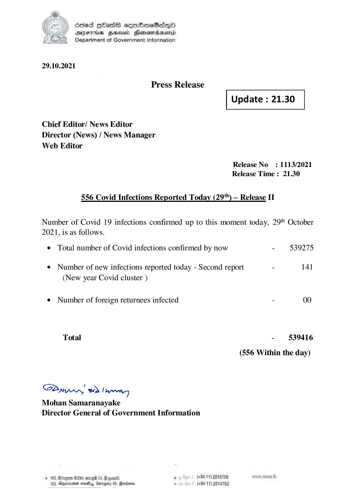

# Press Release - 2021.10.29 - Covid 19 Infection Report 
Key: 79752e64ea092686b301087d41fadb17 

---
```
) died Gass ceembeSsdqQo
DFS BHU Honswnradasentd
2 Department of Government Information

   

29.10.2021

Press Release

 

Update : 21.30

 

 

 

Chief Editor/ News Editor
Director (News) / News Manager
Web Editor

Release No: 1113/2021
Release Time : 21.30

556 Covid Infections Reported Today (29") — Release IT

Number of Covid 19 infections confirmed up to this moment today, 29" October
2021, is as follows.

¢ Total number of Covid infections confirmed by now - 539275
¢ Number of new infections reported today - Second report - 141
(New year Covid cluster )
e¢ Number of foreign returnees infected - 00
Total - 539416
(556 Within the day)

Saar eed Joanng
Mohan Samaranayake
Director General of Government Information

© 163, Beizgoe S00, ore 05, # goane ° (#94 11) 2518789
163, Aparna seseiy, Gnrogiry 05, Ravens, - (+94 11) 2514753

```
