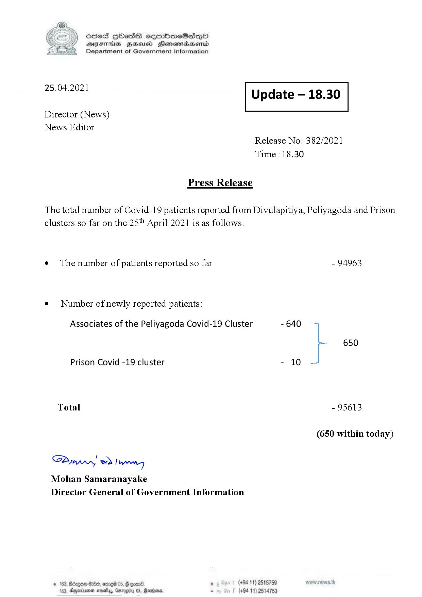

# Press Release - 2021.04.25 
Key: 7a4e1e3b98df018b116cc5657fb6acd8 

---
```
S) ScseS HOasdS cerrbmeSdQo
SVsThis geod Henssnadasombd
Department of Government Information

 

 

25.04.2021

 

Update — 18.30

 

 

Director (News)
News Editor

Press Release

Release No: 382/2021
Time :18.30

The total number of Covid-19 patients reported from Divulapitiya, Peliyagoda and Prison

clusters so far on the 25" April 2021 is as follows.
e¢ The number of patients reported so far

¢ Number of newly reported patients:

Associates of the Peliyagoda Covid-19 Cluster

Prison Covid -19 cluster

Total

Saw 2) wong
Mohan Samaranayake
Director General of Government Information

© 163, Btagow 80, ore 05, # gone , (+94 11) 2515759
183, Ayecinimes wovelay, Garogity 05, Marian . (+94 11) 2514753

- 94963
- 640
650
- 10
- 95613
(650 within today)

```
