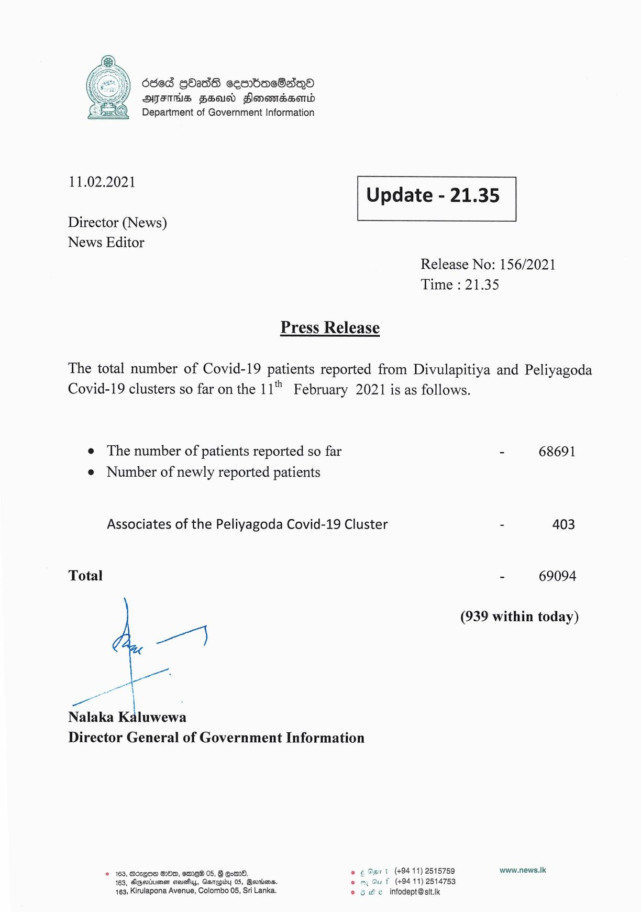

# Press Release - 2021.02.11 
Key: 7a5776d464332f611de3a9309f9c2664 

---
```
686d QOadG cesrbacSaqQo
OMFS FEI) Fonomaesord
Department of Government Information

 

 

11.02.2021
Update - 21.35

 

 

 

Director (News)

News Editor
Release No: 156/2021

Time : 21.35

Press Release
The total number of Covid-19 patients reported from Divulapitiya and Peliyagoda

Covid-19 clusters so far on the 11" February 2021 is as follows.

e The number of patients reported so far - 68691
e Number of newly reported patients

Associates of the Peliyagoda Covid-19 Cluster - 403

Total - 69094

(939 within today)

a)

Nalaka Kaluwewa
Director General of Government Information

4

© 163, Boxgoe EBD, emI_H 05, Gots. © ¢ Out (+9411) 2515759 www.news.lk
163, Higeriuimen sauatys, Gaapidy 05, Bovsiens, wu F (49411) 2514753
163, Kirulapona Avenue, Colombo 05, Sri Lanka. © 9 He infodept@sit.k

 

```
