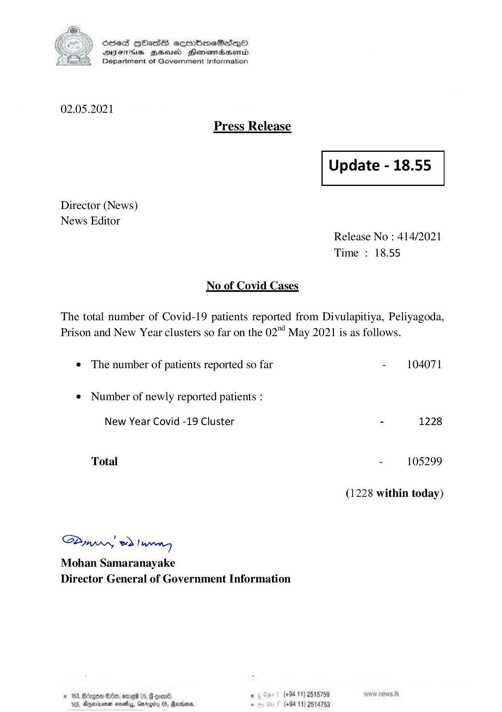

# Press Release - 2021.05.02 
Key: 7b7718e658689157f4bbec703608ccc2 

---
```
) ScdeS HOadS cermbmeSsdQo
DVEFIHS HHosd Honomabsenid
Department of Government Information

 

02.05.2021
Press Release

 

Update - 18.55

 

 

Director (News)
News Editor

Release No : 414/2021
Time : 18.55

No of Covid Cases

The total number of Covid-19 patients reported from Divulapitiya, Peliyagoda,
Prison and New Year clusters so far on the 02™ May 2021 is as follows.

e The number of patients reported so far - 104071

¢ Number of newly reported patients :

New Year Covid -19 Cluster - 1228

Total - 105299

(1228 within today)

Saw eo) wry
Mohan Samaranayake
Director General of Government Information

© 163, Bingo 80, omrei 05, @ coan®. , (+84 11) 251579 ww news.te
163, Aqerne sethy,, Garogiry 0S, Ranson - (+94 11) 2514753

 

```
