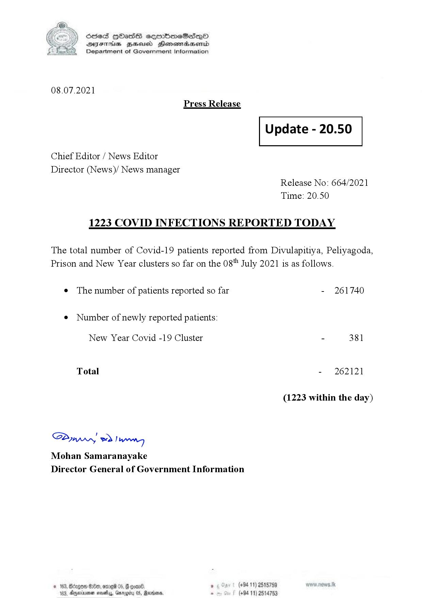

# Press Release - 2021.07.08 - Covid 19 infection report 
Key: 7bafc0a9b34e44f6a86bccaca60dcd28 

---
```
(6 S) ScseS HOasdS cerrbmeSdQo
DFTs BHEosd Henewtaeasernid
Department of Government Information

 

08.07.2021
Press Release

Chief Editor / News Editor
Director (News)/ News manager

 

 

Update - 20.50

 

 

Release No: 664/2021
Time: 20.50

1223 COVID INFECTIONS REPORTED TODAY

The total number of Covid-19 patients reported from Divulapitiya, Peliyagoda,
Prison and New Year clusters so far on the 08" July 2021 is as follows.

e The number of patients reported so far

¢ Number of newly reported patients:

New Year Covid -19 Cluster

Total

Saw 2) won,
Mohan Samaranayake
Director General of Government Information

© 163, ong

 

- 261740

- 381

- 262121

(1223 within the day)

00, ome 05, § qoar® , (+94 11) 2515759

103, Ageinvemen wos, Garg 05, Randers. . (+94 11) 2514753

```
