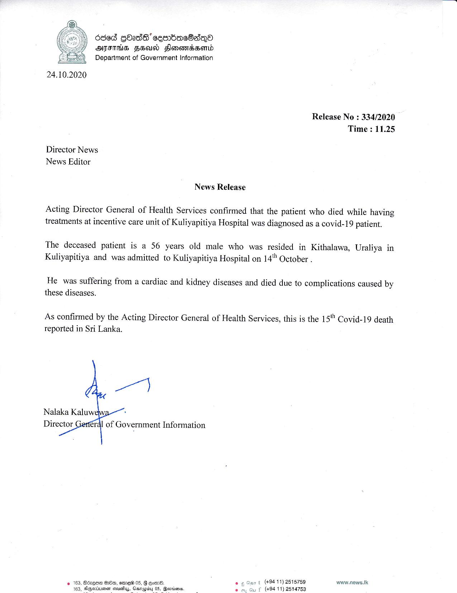

# Press Release - 2020.10.24 - The 15th Covid 19 death reported in Sri Lanka 
Key: 7c1b60fe7a350ab1971f5225ba7ffc42 

---
```
686d GO2d8' cesrbac8aQoa
ATS FE Slomemrssond
Department of Government Information

 

24.10.2020

Director News
News Editor

News Release

Release No : 334/2020
Time : 11.25

Acting Director General of Health Services confirmed that the patient who died while having
treatments at incentive care unit of Kuliyapitiya Hospital was diagnosed as a covid-19 patient.

The deceased patient is a 56 years old male who was resided in Kithalawa, Uraliya in
Kuliyapitiya and was admitted to Kuliyapitiya Hospital on 14" October .

He was suffering from a cardiac and kidney diseases and died due to complications caused by

these diseases.

As confirmed by the Acting Director General of Health Services, this is the 15"" Covid-19 death

reported in Sri Lanka.

   
  

Nalaka Kaluw
Director éral of Government Information

 

«(494 11) 2515759

(494 11) 2514753

www.news.tk

```
