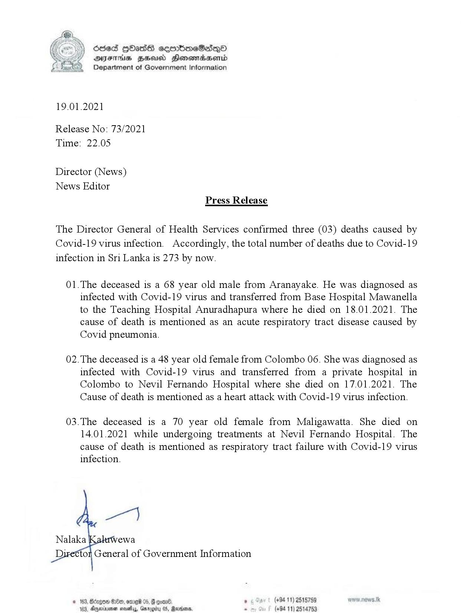

# Press Release - 2021.01.19 - 03 Covid 19 infection deaths have been reported,total deaths rises to 273 
Key: 7c260434dee919ad488110ef7111732d 

---
```
(oe) 650d QOasdS cerrboeSadqQo
y YS DYFMs Bus Heonomaesonid
Department of Government Information

 

19.01.2021

Release No: 73/2021
Time: 22.05

Director (News)
News Editor
Press Release

The Director General of Health Services confirmed three (03) deaths caused by
Covid-19 virus infection. Accordingly, the total number of deaths due to Covid-19
infection in Sri Lanka is 273 by now.

01.The deceased is a 68 year old male from Aranayake. He was diagnosed as
infected with Covid-19 virus and transferred from Base Hospital Mawanella
to the Teaching Hospital Anuradhapura where he died on 18.01.2021. The
cause of death is mentioned as an acute respiratory tract disease caused by
Covid pneumonia.

02. The deceased is a 48 year old female from Colombo 06. She was diagnosed as
infected with Covid-19 virus and transferred from a private hospital in
Colombo to Nevil Fernando Hospital where she died on 17.01.2021. The
Cause of death is mentioned as a heart attack with Covid-19 virus infection.

03.The deceased is a 70 year old female from Maligawatta. She died on
14.01.2021 while undergoing treatments at Nevil Fernando Hospital. The
cause of death is mentioned as respiratory tract failure with Covid-19 virus
infection.

(+94 11) 2515789
(+94 11) 2514753

 

```
