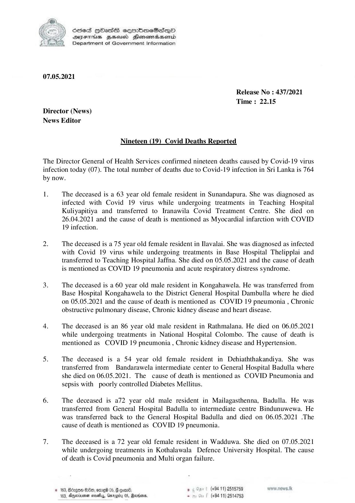

# Press Release - 2021.05.07 - Covid 19 infection deaths 
Key: 7c7d4eb8bccfa81a38fb8a3d66decd53 

---
```
 

6856S HHass sermbmeSasqo
DFTs BHEosd Henewtaeasernid
Department of Government Information

07.05.2021

Release No : 437/2021
Time : 22.15

Director (News)
News Editor

Nineteen (19) Covid Deaths Reported

The Director General of Health Services confirmed nineteen deaths caused by Covid-19 virus
infection today (07). The total number of deaths due to Covid-19 infection in Sri Lanka is 764
by now.

1.

The deceased is a 63 year old female resident in Sunandapura. She was diagnosed as
infected with Covid 19 virus while undergoing treatments in Teaching Hospital
Kuliyapitiya and transferred to Iranawila Covid Treatment Centre. She died on
26.04.2021 and the cause of death is mentioned as Myocardial infarction with COVID
19 infection.

The deceased is a 75 year old female resident in Iavalai. She was diagnosed as infected
with Covid 19 virus while undergoing treatments in Base Hospital Thelipplai and
transferred to Teaching Hospital Jaffna. She died on 05.05.2021 and the cause of death
is mentioned as COVID 19 pneumonia and acute respiratory distress syndrome.

The deceased is a 60 year old male resident in Kongahawela. He was transferred from
Base Hospital Kongahawela to the District General Hospital Dambulla where he died
on 05.05.2021 and the cause of death is mentioned as COVID 19 pneumonia , Chronic
obstructive pulmonary disease, Chronic kidney disease and heart disease.

The deceased is an 86 year old male resident in Rathmalana. He died on 06.05.2021
while undergoing treatments in National Hospital Colombo. The cause of death is
mentioned as COVID 19 pneumonia , Chronic kidney disease and Hypertension.

The deceased is a 54 year old female resident in Dehiaththakandiya. She was
transferred from Bandarawela intermediate center to General Hospital Badulla where
she died on 06.05.2021. The cause of death is mentioned as COVID Pneumonia and
sepsis with poorly controlled Diabetes Mellitus.

The deceased is a72 year old male resident in Mailagasthenna, Badulla. He was
transferred from General Hospital Badulla to intermediate centre Bindunuwewa. He
was transferred back to the General Hospital Badulla and died on 06.05.2021 .The
cause of death is mentioned as COVID 19 pneumonia.

The deceased is a 72 year old female resident in Wadduwa. She died on 07.05.2021
while undergoing treatments in Kothalawala Defence University Hospital. The cause
of death is Covid pneumonia and Multi organ failure.

163, BScogon G00, ome 06, § coand. . 5 (+94 11) 2515789 wonw.nows.tk
183, Agexryenen navel, Garogty 05, Raroonn, - (+94 11) 2514753

 

```
