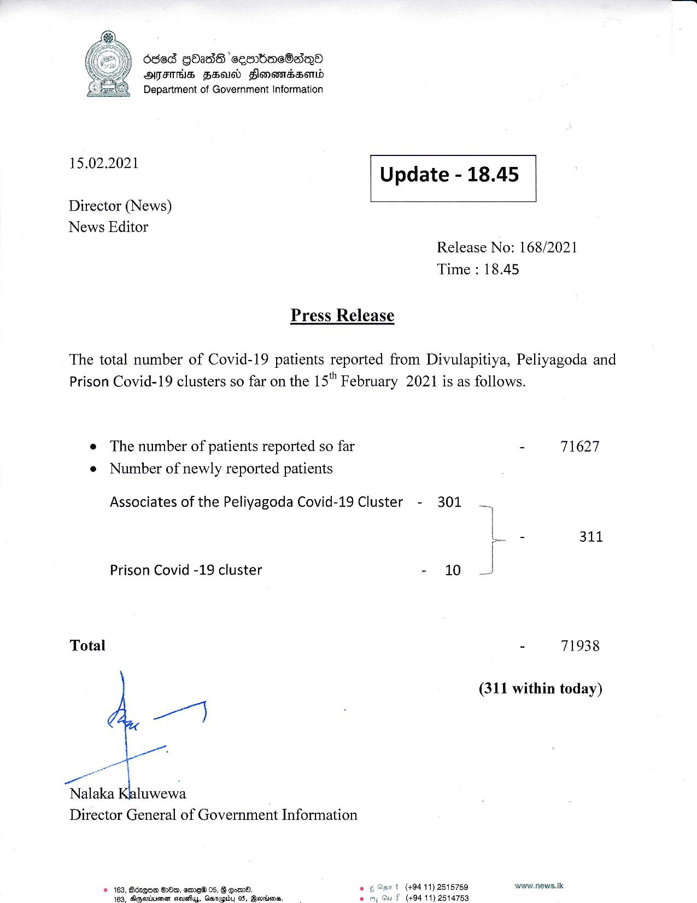

# Press Release - 2021.02.15 
Key: 7c905fd4c2ac51389ec9e91463dacea7 

---
```
Ose GOadG ‘seenb(rmeBasQo
ATITHS FSA FlonemBssomd
Department of Government Information

 

 

15.02.2021 Update - 18.45

 

 

 

Director (News)

News Editor
Release No: 168/2021

Time : 18.45

Press Release

The total number of Covid-19 patients reported from Divulapitiya, Peliyagoda and
Prison Covid-19 clusters so far on the 15" February 2021 is as follows.

e The number of patients reported so far - 71627
e Number of newly reported patients

Associates of the Peliyagoda Covid-19 Cluster - 301
- 311

Prison Covid -19 cluster - 10

Total - 71938

(311 within today)

 

Director General of Government Information

t (494 11) 2515759 www.news. lic

© 163, BozqQEm BD, semeW 05, B eon.
(494 11) 2514753

483, Aepeotiuenen srousfuy, Gatupibdy 05, Bevnisns.

 

```
