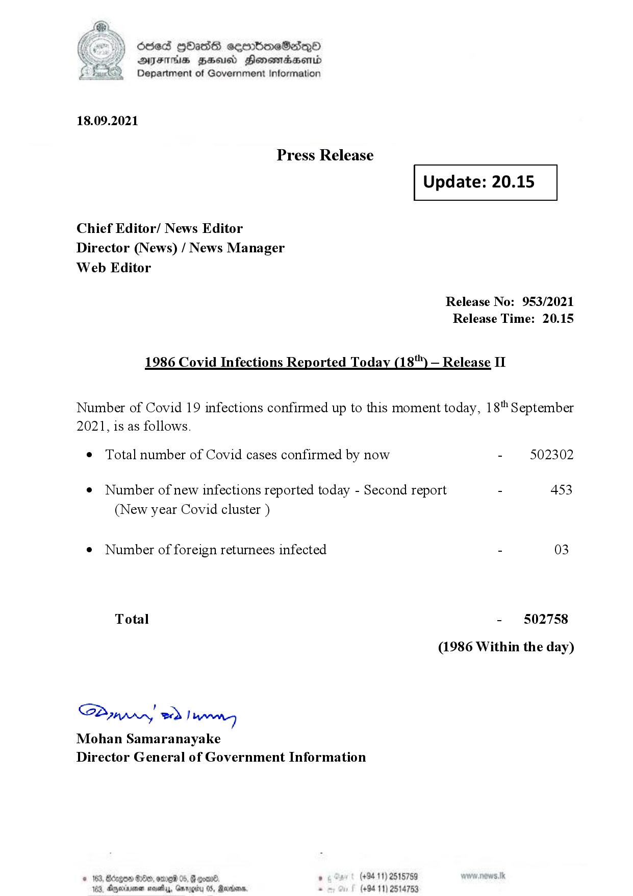

# Press Release - 2021.09.18 - Covid 19 Infection Report 
Key: 7dd1efaa0c3d109a793cf17fdb8bd791 

---
```
dosed GOass eemmbmeSadepO
DFS BHU Honswnradasentd
Department of Government Information

 
 

18.09.2021

Press Release

Chief Editor/ News Editor
Director (News) / News Manager
Web Editor

 

 

Update: 20.15

 

 

Release No: 953/2021
Release Time: 20.15

1986 Covid Infections Reported Today (18") — Release II

Number of Covid 19 infections confirmed up to this moment today, 18" September

2021, is as follows.

¢ Total number of Covid cases confirmed by now

¢ Number of new infections reported today - Second report

(New year Covid cluster )

¢ Number of foreign returnees infected

Total

Saar eed } hang
Mohan Samaranayake
Director General of Government Information

© 163,

 

0eb, 019 05, 6 eon®. ° (+94 11) 2518759
163, Ageia sasty, Garogiy 05, Ravana - (+94 11) 2514753

- 502302

453

- 502758
(1986 Within the day)

```
