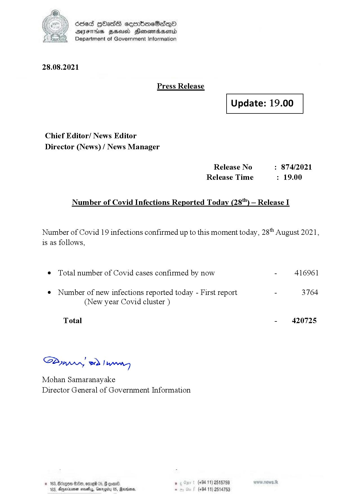

# Press Release - 2021.08.28 
Key: 7deaff3be5b796b0c846db5d768151b3 

---
```
(2) Oded QOasS cseenboeSiqQo
DFS HHS Honsmnadaerntd
Department of Government Information

 

28.08.2021

Press Release

 

Update: 19.00

 

 

 

Chief Editor/ News Editor
Director (News) / News Manager

Release No : 874/2021
Release Time : 19.00

Number of Covid Infections Reported Today (28") — Release I

Number of Covid 19 infections confirmed up to this moment today, 28" August 2021,
is as follows,

¢ Total number of Covid cases confirmed by now - 416961

¢ Number of new infections reported today - First report - 3764
(New year Covid cluster )

Total - 420725

SB, eed | Mens

Mohan Samaranayake
Director General of Government Information

   

188, Anexivenan noes, Garogiy 05, Mardoorn,

```
