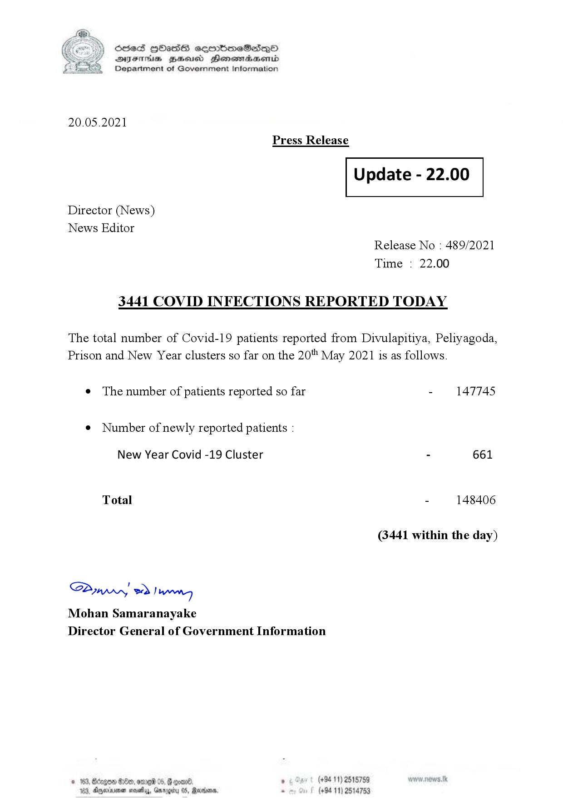

# Press Release - 2021.05.20 - Covid 19 infection report 
Key: 7ee2927c0e4ea29b9e5fb30e5429e637 

---
```
S) ScseS HOasdS cerrbmeSdQo
DFTs BHEosd Henewtaeasernid
Department of Government Information

 

20.05.2021

Press Release

 

Update - 22.00

 

 

 

Director (News)

News Editor
Release No : 489/2021
Time : 22.00

3441 COVID INFECTIONS REPORTED TODAY

The total number of Covid-19 patients reported from Divulapitiya, Peliyagoda,
Prison and New Year clusters so far on the 20" May 2021 is as follows.

e The number of patients reported so far - 147745

¢ Number of newly reported patients :

New Year Covid -19 Cluster - 661
Total - 148406
(3441 within the day)

Syw ed) wenn
Mohan Samaranayake
Director General of Government Information

 

© 163, Bdrgow He, amr 05, oom . (+94 11) 2515759
163, Dggeriremen mosey, Gmrggity 08, Reisen, . (+94 11) 2514753

```
