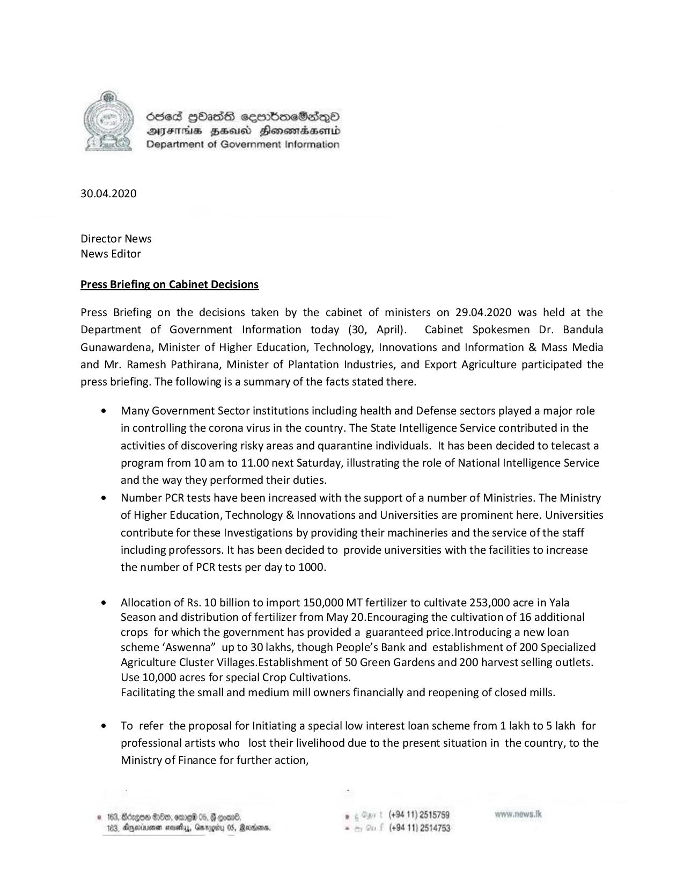

# Cabinet Decisions - 2020.04.30 
Key: 7f477ea179f8a1930234d72c0144c37f 

---
```
Ssed HbOasG sembmeSedqoO
AIFS BHU Honemasenid
Department of Government Information

 

30.04.2020

Director News
News Editor

Press Briefing on Cabinet Decisions

Press Briefing on the decisions taken by the cabinet of ministers on 29.04.2020 was held at the
Department of Government Information today (30, April). Cabinet Spokesmen Dr. Bandula
Gunawardena, Minister of Higher Education, Technology, Innovations and Information & Mass Media
and Mr. Ramesh Pathirana, Minister of Plantation Industries, and Export Agriculture participated the
press briefing. The following is a summary of the facts stated there.

e¢ Many Government Sector institutions including health and Defense sectors played a major role
in controlling the corona virus in the country. The State Intelligence Service contributed in the
activities of discovering risky areas and quarantine individuals. It has been decided to telecast a
program from 10 am to 11.00 next Saturday, illustrating the role of National Intelligence Service
and the way they performed their duties.

e Number PCR tests have been increased with the support of a number of Ministries. The Ministry
of Higher Education, Technology & Innovations and Universities are prominent here. Universities
contribute for these Investigations by providing their machineries and the service of the staff
including professors. It has been decided to provide universities with the facilities to increase
the number of PCR tests per day to 1000.

¢ Allocation of Rs. 10 billion to import 150,000 MT fertilizer to cultivate 253,000 acre in Yala
Season and distribution of fertilizer from May 20.Encouraging the cultivation of 16 additional
crops for which the government has provided a guaranteed price.Introducing a new loan
scheme ‘Aswenna” up to 30 lakhs, though People’s Bank and establishment of 200 Specialized
Agriculture Cluster Villages.Establishment of 50 Green Gardens and 200 harvest selling outlets.
Use 10,000 acres for special Crop Cultivations.
Facilitating the small and medium mill owners financially and reopening of closed mills.

¢ To refer the proposal for Initiating a special low interest loan scheme from 1 lakh to 5 lakh for
professional artists who lost their livelihood due to the present situation in the country, to the
Ministry of Finance for further action,

ODE 05, G goa , (+94 11) 2515759 won nows Ik
nod, Garety 05, Radars, 2 (+94 11) 2514753

 

 

183, Aejern

```
