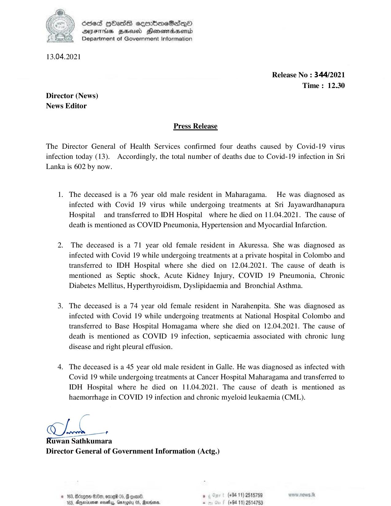

# Press Release - 2021.04.13 - Covid 19 infection deaths 
Key: 803ba936edc9966771607ab0c20f4720 

---
```
 

CseS |HasG sermbireSasQo
AIFS HSU Henewmadasertd
Department of Government Information

13.04.2021

Release No : 344/2021

Time : 12.30
Director (News)
News Editor
Press Release
The Director General of Health Services confirmed four deaths caused by Covid-19 virus

infec

tion today (13). Accordingly, the total number of deaths due to Covid-19 infection in Sri

Lanka is 602 by now.

1.

The deceased is a 76 year old male resident in Maharagama. He was diagnosed as
infected with Covid 19 virus while undergoing treatments at Sri Jayawardhanapura
Hospital and transferred to IDH Hospital where he died on 11.04.2021. The cause of
death is mentioned as COVID Pneumonia, Hypertension and Myocardial Infarction.

2. The deceased is a 71 year old female resident in Akuressa. She was diagnosed as

infected with Covid 19 while undergoing treatments at a private hospital in Colombo and
transferred to IDH Hospital where she died on 12.04.2021. The cause of death is
mentioned as Septic shock, Acute Kidney Injury, COVID 19 Pneumonia, Chronic
Diabetes Mellitus, Hyperthyroidism, Dyslipidaemia and Bronchial Asthma.

The deceased is a 74 year old female resident in Narahenpita. She was diagnosed as
infected with Covid 19 while undergoing treatments at National Hospital Colombo and
transferred to Base Hospital Homagama where she died on 12.04.2021. The cause of
death is mentioned as COVID 19 infection, septicaemia associated with chronic lung
disease and right pleural effusion.

4. The deceased is a 45 year old male resident in Galle. He was diagnosed as infected with

Covid 19 while undergoing treatments at Cancer Hospital Maharagama and transferred to
IDH Hospital where he died on 11.04.2021. The cause of death is mentioned as
haemorrhage in COVID 19 infection and chronic myeloid leukaemia (CML).

a

Ch +

Ruwan Sathkumara
Director General of Government Information (Actg.)

© 163, Bdzgon #180, omreid 05.  coane . (+94 11) 2515759 ww. nOws,
163, Anerrman neta, Garogity 08, Raion, s (+94 11) 2514753

```
