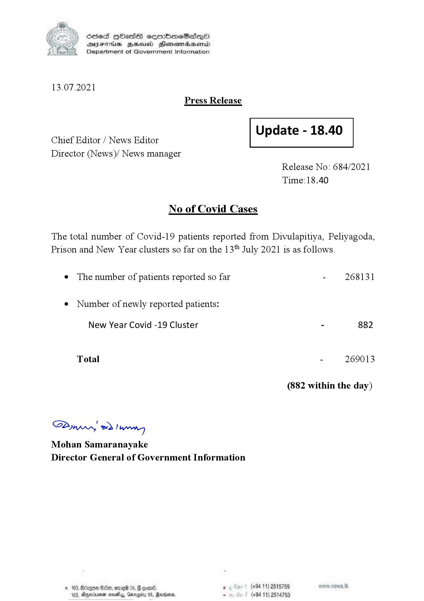

# Press Release - 2021.07.13 
Key: 807ad995bf728a598b3fc09402e14af5 

---
```
S) ScseS HOasdS cerrbmeSdQo
DFTs BHEosd Henewtaeasernid
Department of Government Information

 

13.07.2021
Press Release

 

aaa: Update - 18.40
Chief Editor / News Editor

Director (News)/ News manager

 

 

 

Release No: 684/2021
Time:18.40

No of Covid Cases

The total number of Covid-19 patients reported from Divulapitiya, Peliyagoda,
Prison and New Year clusters so far on the 13" July 2021 is as follows.

e The number of patients reported so far - 268131

¢ Number of newly reported patients:

New Year Covid -19 Cluster - 882

Total - 269013
(882 within the day)
Saw 2) wn

Mohan Samaranayake
Director General of Government Information

$20, ome 06, 8 goav8. , (+94 11) 2515759
DAnarinoe sevety, Garogicy 05, Raden, - (+94 11) 2514753

 

```
