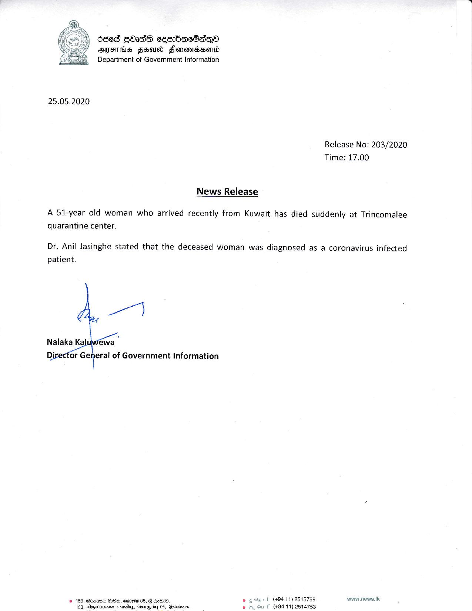

# Press Release - 2020.05.25 - A 51 years old woman has died suddnley at Trincomalee quarantine center 
Key: 8260f902d85a6a508f48da1560ef238c 

---
```
6865 GOAdS cesrbasSsQo®
OIF HSU Sonenrdsemd
Department of Government Information

 

25.05.2020

Release No: 203/2020
Time: 17.00

News Release

A 51-year old woman who arrived recently from Kuwait has died suddenly at Trincomalee
quarantine center.

Dr. Anil Jasinghe stated that the deceased woman was diagnosed as a coronavirus infected
patient.

   

‘or General of Government Information

 

pr t (484 11) 2518759 www.news.Ik
wy f (494 11) 2514753

2 168, Béaqoa O80, emew 05, G om.
AGetiussr sravatiyg, Gerapiiny 05, Gorriens.

   

```
