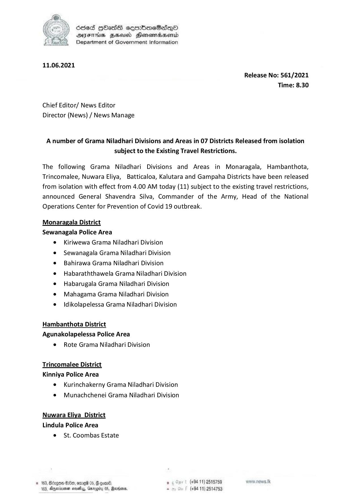

# Press Release - 2021.06.11 - A nuber of Grama Niladhari Divisions and Areas in 07 Districts Released from isolation subject to the Existing Travel Restrictions 
Key: 82d6a82e1eaa4f5cdb85a252c04c2c76 

---
```
Ssed HOassg sembmeSadqo
AIFS HSU Henomasenid
Department of Government Information

 

11.06.2021

Chief Editor/ News Editor
Director (News) / News Manage

Release No: 561/2021
Time: 8.30

A number of Grama Niladhari Divisions and Areas in 07 Districts Released from isolation

subject to the Existing Travel Restrictions.

The following Grama Niladhari Divisions and Areas in Monaragala, Hambanthota,

Trincomalee, Nuwara Eliya, Batticaloa, Kalutara and Gampaha Districts have been released
from isolation with effect from 4.00 AM today (11) subject to the existing travel restrictions,
announced General Shavendra Silva, Commander of the Army, Head of the National

Operations Center for Prevention of Covid 19 outbreak.

Monaragala District
Sewanagala Police Area

¢ Kiriwewa Grama Niladhari Division

e Sewanagala Grama Niladhari Division

¢ Bahirawa Grama Niladhari Division

¢ Habaraththawela Grama Niladhari Division
e Habarugala Grama Niladhari Division

e Mahagama Grama Niladhari Division

e  Idikolapelessa Grama Niladhari Division

Hambanthota District
Agunakolapelessa Police Area
¢ Rote Grama Niladhari Division

Trincomalee District

Kinniya Police Area
e  Kurinchakerny Grama Niladhari Division
¢ Munachchenei Grama Niladhari Division

Nuwara Eliya District
Lindula Police Area

© St. Coombas Estate

. (+94 11) 2515759
. (+94 11) 2514753

16. poe
163, Dgernionen osetia, Ga,

 

 

```
