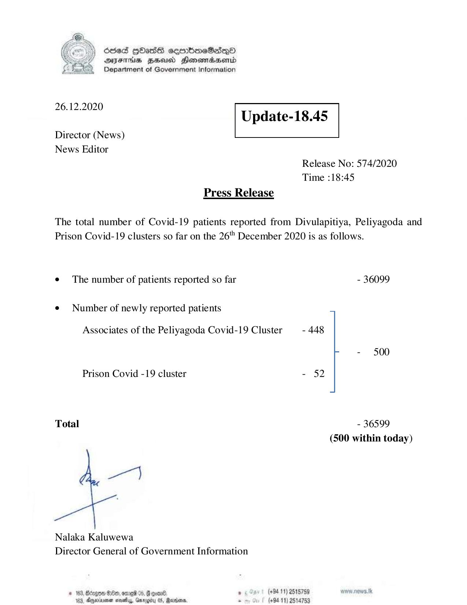

# Press Release - 2020.12.26 
Key: 84219e405b917ed5d049c8a188c912fb 

---
```
6563 HOHasG sembmcSasqQo
DAJFITAs BHU Honomrdbsertd
Department of Government Information

 

 

26.12.2020
Update-18.45

 

 

 

Director (News)
News Editor
Release No: 574/2020
Time :18:45
Press Release

The total number of Covid-19 patients reported from Divulapitiya, Peliyagoda and
Prison Covid-19 clusters so far on the 26" December 2020 is as follows.

¢ The number of patients reported so far - 36099

¢ Number of newly reported patients
Associates of the Peliyagoda Covid-19 Cluster - 448
- 500

Prison Covid -19 cluster - 52

Total - 36599
(500 within today)

Nalaka Kaluwewa
Director General of Government Information

# 163, Bergen 8:00, ome %, Geoan®. , (+84 11) 2515759 pw. news. tk
183, Oryeciarmer mosedlyy, Gnrogcu 05, Marisa. . (+9411) 2514753

```
