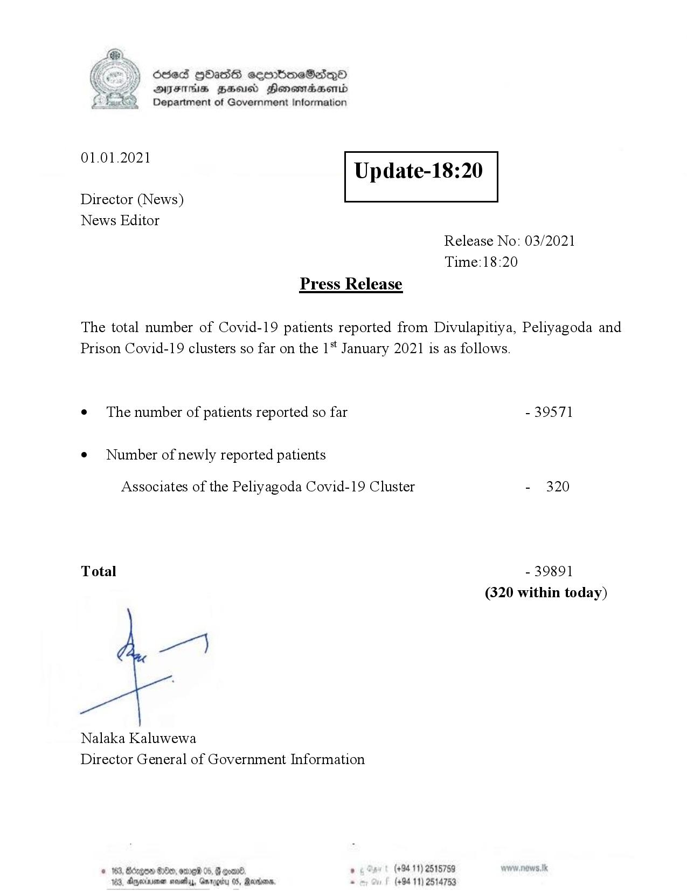

# Press Release - 01.01.2021 
Key: 849fb2952a749d40fca2f4d347b520d1 

---
```
Ssed HbasG sembmeSadqo
DAIS BHU Honomasentd
Department of Government Information

 

 

01.01.2021

Update-18:20

 

 

 

Director (News)
News Editor
Release No: 03/2021
Time:18:20
Press Release

The total number of Covid-19 patients reported from Divulapitiya, Peliyagoda and
Prison Covid-19 clusters so far on the 1* January 2021 is as follows.
e¢ The number of patients reported so far - 39571

¢ Number of newly reported patients

Associates of the Peliyagoda Covid-19 Cluster - 320

Total - 39891

(320 within today)

Nalaka Kaluwewa
Director General of Government Information

© 163, Bécge &0eo, orme® 05, @ con®. 8 (+94 11) 2515759
163, Agexuee neaty, Grrggiy 05, Rares. - (+94 11) 2514753

 

```
