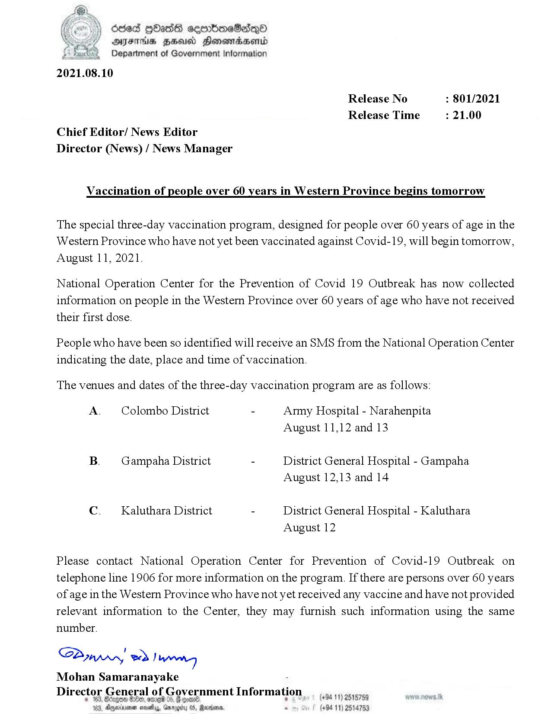

# Press Release  - 2021.08.10 -  Vaccination of people over 60 years in Western Province begins tomorrow 
Key: 85429a8ce74fc21429363f433a8115fb 

---
```
fy }) Seed HOass cecmbimeSadq—nd
AIJFTHS HEU Honomadaend
Department of Government Information

2021.08.10

 

Release No : 801/2021
Release Time : 21.00
Chief Editor/ News Editor
Director (News) / News Manager

Vaccination of people over 60 years in Western Province begins tomorrow

The special three-day vaccination program, designed for people over 60 years of age in the
Western Province who have not yet been vaccinated against Covid-19, will begin tomorrow,
August 11, 2021.

National Operation Center for the Prevention of Covid 19 Outbreak has now collected
information on people in the Western Province over 60 years of age who have not received
their first dose.

People who have been so identified will receive an SMS from the National Operation Center
indicating the date, place and time of vaccination.

The venues and dates of the three-day vaccination program are as follows:

A. — Colombo District - Army Hospital - Narahenpita
August 11,12 and 13

B. —Gampaha District - District General Hospital - Gampaha
August 12,13 and 14

C. — Kaluthara District - District General Hospital - Kaluthara
August 12

Please contact National Operation Center for Prevention of Covid-19 Outbreak on
telephone line 1906 for more information on the program. If there are persons over 60 years
of age in the Western Province who have not yet received any vaccine and have not provided
relevant information to the Center, they may furnish such information using the same
number.

S2ynpry wr Jang
Mohan Samaranayake -
Director General of Government Information

39 HH, omg 0

. (+94 11) 2515789
B, Apeinimen sets, x

05, Reoians. - (+94 11) 2514753

 

```
