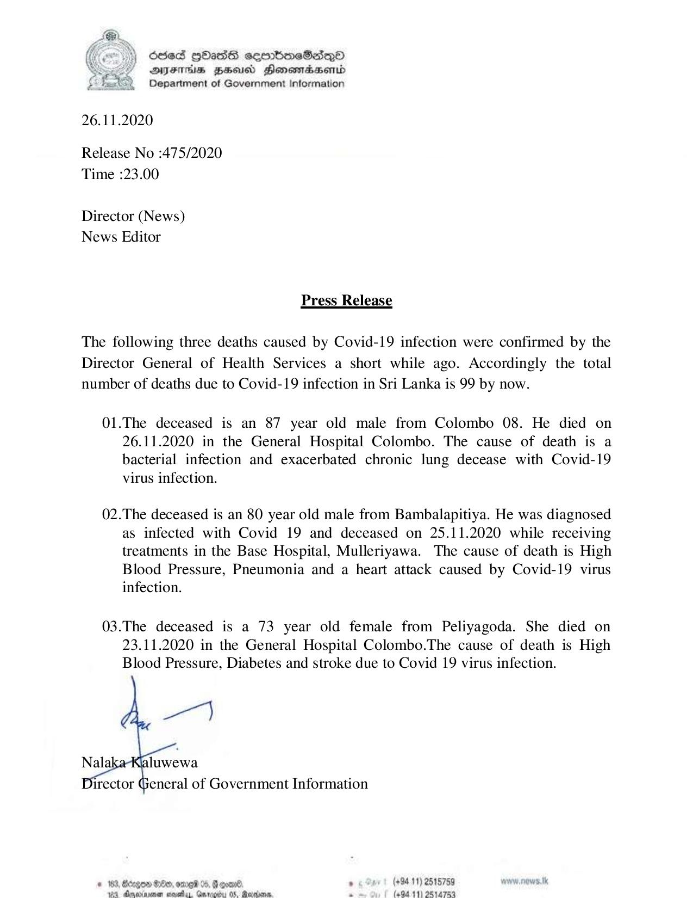

# Press Release - 2020.11.26 - Covid 19 infection death rises to 99 
Key: 855954d95bd34a243c4b10c06095055a 

---
```
  
 

) 66S Hass seertoeSedqQo
DFITHAS HEU Honowrdserid
Department of Government Information

26.11.2020

Release No :475/2020
Time :23.00

Director (News)
News Editor

Press Release

The following three deaths caused by Covid-19 infection were confirmed by the
Director General of Health Services a short while ago. Accordingly the total
number of deaths due to Covid-19 infection in Sri Lanka is 99 by now.

01.The deceased is an 87 year old male from Colombo 08. He died on
26.11.2020 in the General Hospital Colombo. The cause of death is a
bacterial infection and exacerbated chronic lung decease with Covid-19
virus infection.

02.The deceased is an 80 year old male from Bambalapitiya. He was diagnosed
as infected with Covid 19 and deceased on 25.11.2020 while receiving
treatments in the Base Hospital, Mulleriyawa. The cause of death is High
Blood Pressure, Pneumonia and a heart attack caused by Covid-19 virus
infection.

03.The deceased is a 73 year old female from Peliyagoda. She died on
23.11.2020 in the General Hospital Colombo.The cause of death is High
Blood Pressure, Diabetes and stroke due to Covid 19 virus infection.

   

Nala luwewa

eneral of Government Information

. (494.11) 218759 nww.nn0wS.tk
(69411) 2514753

 

```
