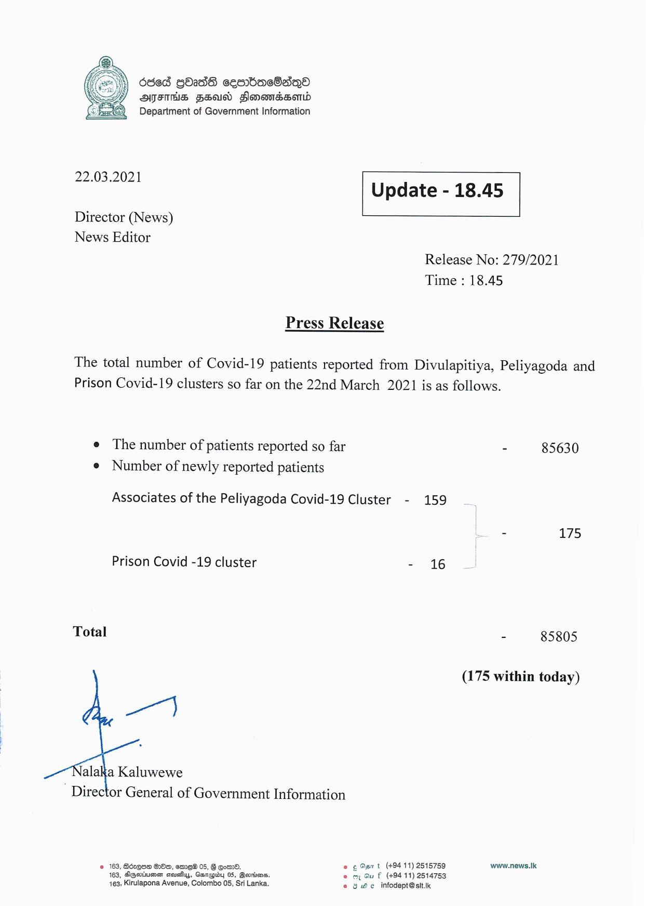

# Press Release - 2021.03.22 
Key: 85cb1aabae84c5ccb0c123f01ce91d3a 

---
```
Oded gOadS cesrbacSaqQo
AIFS FEA Flonomdserd
Department of Government Information

 

 

22.03.2021 Update - 18.45

 

 

 

Director (News)

News Editor
Release No: 279/2021
Time : 18.45

Press Release

The total number of Covid-19 patients reported from Divulapitiya, Peliyagoda and
Prison Covid-19 clusters so far on the 22nd March 2021 is as follows.

e The number of patients reported so far - 85630
e Number of newly reported patients

Associates of the Peliyagoda Covid-19 Cluster - 159
- 175

Prison Covid -19 cluster - 16

Total - 85805

(175 within today)

  
 

alaka Kaluwewe
Director General of Government Information

© 163, Bdzqo@ 8280, emre® 05, § eomd. © ¢ Oar t (+94 11) 2515759 www.news.Ik
163, Aqariuee seusfiys, Ganapiby 05, Beorims. © oy Gu f (+94 11) 2514753
163, Kirulapona Avenue, Colombo 05, Sri Lanka. e 8 He infodept@sit.ik

```
