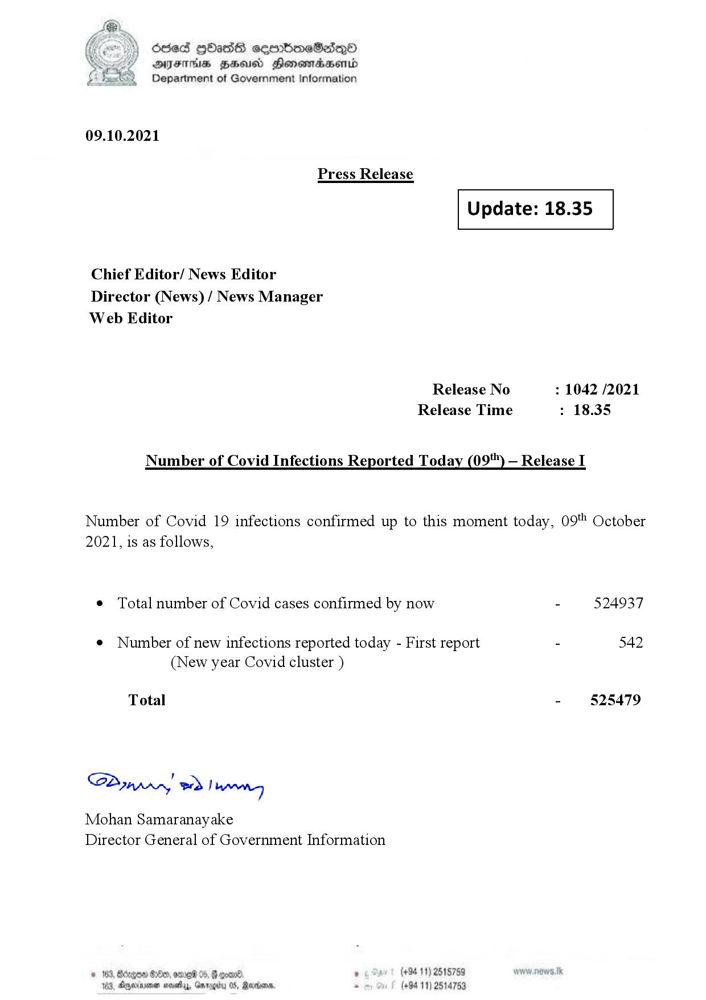

# Press Release - 2021.10.09 
Key: 86670ed635739346dde78b3318938610 

---
```
(oe) Sed QOass cerrbroeSadqQo
DFS HHS Honsmnadaerntd
Department of Government Information

 

09.10.2021

Press Release

 

Update: 18.35

 

 

 

Chief Editor/ News Editor
Director (News) / News Manager
Web Editor

Release No : 1042 /2021
Release Time : 18.35

Number of Covid Infections Reported Today (09'") — Release I

Number of Covid 19 infections confirmed up to this moment today, 09 October
2021, is as follows,

¢ Total number of Covid cases confirmed by now - 524937

¢ Number of new infections reported today - First report - 542
(New year Covid cluster )

-  §25479

Total

Sa mprn! wd! wong

Mohan Samaranayake
Director General of Government Information

(+94 11) 2515759
(+94 11) 2514753

 

```
