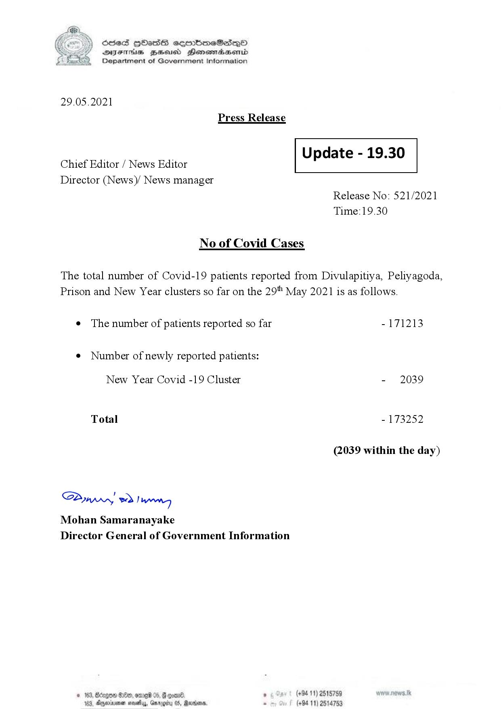

# Press Release - 2021.05.29 
Key: 867d550fe3c95546d9a41804dc2edc3a 

---
```
S) ScseS HOasdS cerrbmeSdQo
DFTs BHEosd Henewtaeasernid
Department of Government Information

 

29.05.2021
Press Release

 

Update - 19.30

 

 

Chief Editor / News Editor
Director (News)/ News manager

 

Release No: 521/2021
Time:19.30

No of Covid Cases

The total number of Covid-19 patients reported from Divulapitiya, Peliyagoda,
Prison and New Year clusters so far on the 29" May 2021 is as follows.

¢ The number of patients reported so far - 171213

¢ Number of newly reported patients:

New Year Covid -19 Cluster - 2039
Total - 173252
(2039 within the day)

Sw 2) wn
Mohan Samaranayake
Director General of Government Information

© 163, Bdogon $00, ome 0 p. . (+9411) 2515759
103, Agere nays, Garey 05, Rardin . (+94 11) 2514753

 
 

```
