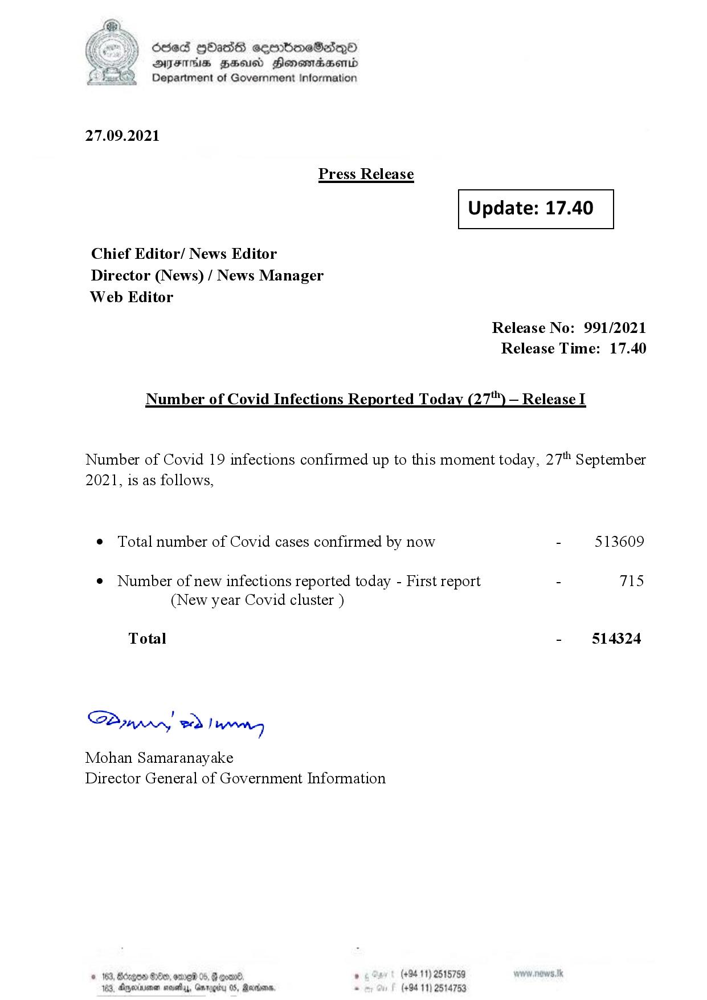

# Press Release - 2021.09.27 
Key: 87ba84e45fee13fa95c329a05648e238 

---
```
fe) Oded Hbas eeenbmeSedeqQO
DFS HHS Honsmadserid
Department of Government Information

 

27.09.2021

Press Release

 

 

Update: 17.40

 

 

Chief Editor/ News Editor
Director (News) / News Manager

Web Editor
Release No: 991/2021
Release Time: 17.40

Number of Covid Infections Reported Today (27) — Release I

Number of Covid 19 infections confirmed up to this moment today, 27" September
2021, is as follows,

¢ Total number of Covid cases confirmed by now - 513609

¢ Number of new infections reported today - First report - 715
(New year Covid cluster )

- §14324

Total

SPynprny wd! weg

Mohan Samaranayake
Director General of Government Information

(+94 11) 2515759
(+94 11) 2514753

  

© 163, Bdrgon Ge, ome 04
103, Dexrmen novelas, Garogi

```
