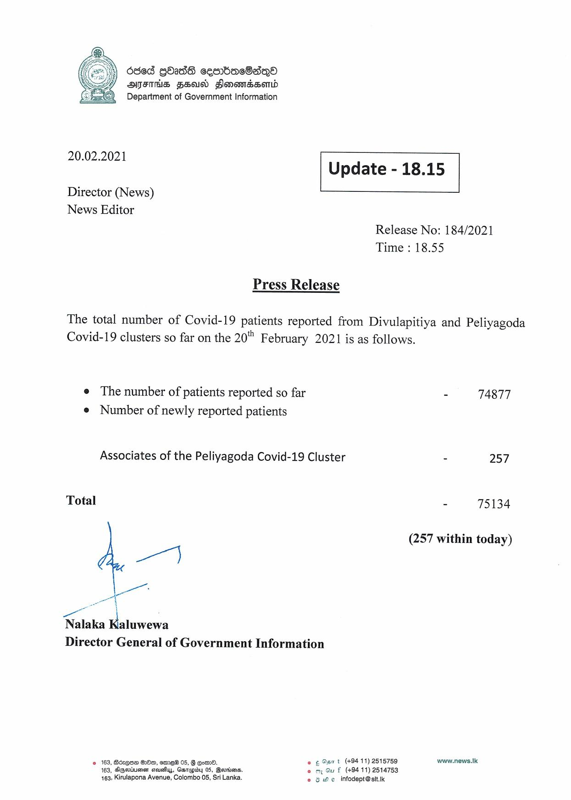

# Press Release - 2021.02.20 
Key: 87d2af33d15f17d36021737118a54045 

---
```
680d GOass cesrbdacSsqea
OANFIHS FEA FHlonomdsond
Department of Government Information

 

 

20.02.2021

 

Update - 18.15

 

 

Director (News)
News Editor

Release No: 184/2021
Time : 18.55

Press Release

The total number of Covid-19 patients reported from Divulapitiya and Peliyagoda
Covid-19 clusters so far on the 20" February 2021 is as follows.

e The number of patients reported so far
e Number of newly reported patients

Associates of the Peliyagoda Covid-19 Cluster

Total

any

Nalaka Kaluwewa
Director General of Government Information

gn t (+9411) 2515759
© 163, Bczgem 20, emre® 05, G eon. ee Omrt (+
163, Agsoiussn asusihy, Gsmapiby 05, Barions. © my Gu f (+94 11) 2514753
163, Kirulapona Avenue, Colombo 05, Sri Lanka. © 9 we infodept@stt.ik

: 74877

= 257

- 75134

(257 within today)

www.news.Ik

```
