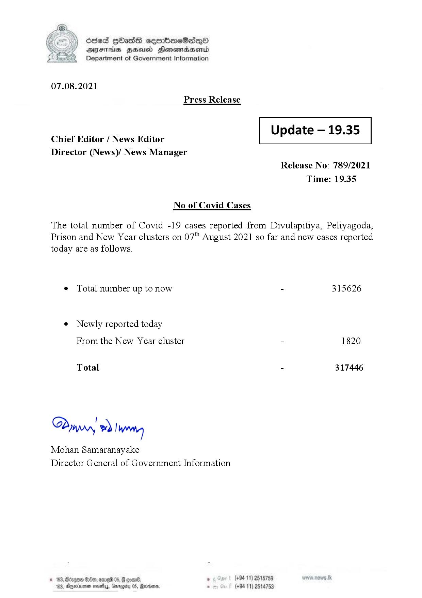

# Press Release - 2021.08.07 
Key: 87eb282147012020ceb7b26aa77d38c1 

---
```
dosed HOasG cemmbmeSadqO
DFS HHS Hensrradaentd
Department of Government Information

 

07.08.2021
Press Release

 

Update — 19.35

 

 

Chief Editor / News Editor
Director (News)/ News Manager

 

Release No: 789/2021
Time: 19.35

No of Covid Cases

The total number of Covid -19 cases reported from Divulapitiya, Peliyagoda,
Prison and New Year clusters on 07" August 2021 so far and new cases reported
today are as follows.

¢ Total number up to now - 315626

e¢ Newly reported today
From the New Year cluster - 1820

Total - 317446

!
Dinar 9! wren
Mohan Samaranayake
Director General of Government Information

© 163, Bdagen $1000, ered 05, gone. ° (+94 11) 2515759
104, Anema nevetyy, Gerogiy 05, Rarens, . (+94 11) 2514753

 

```
