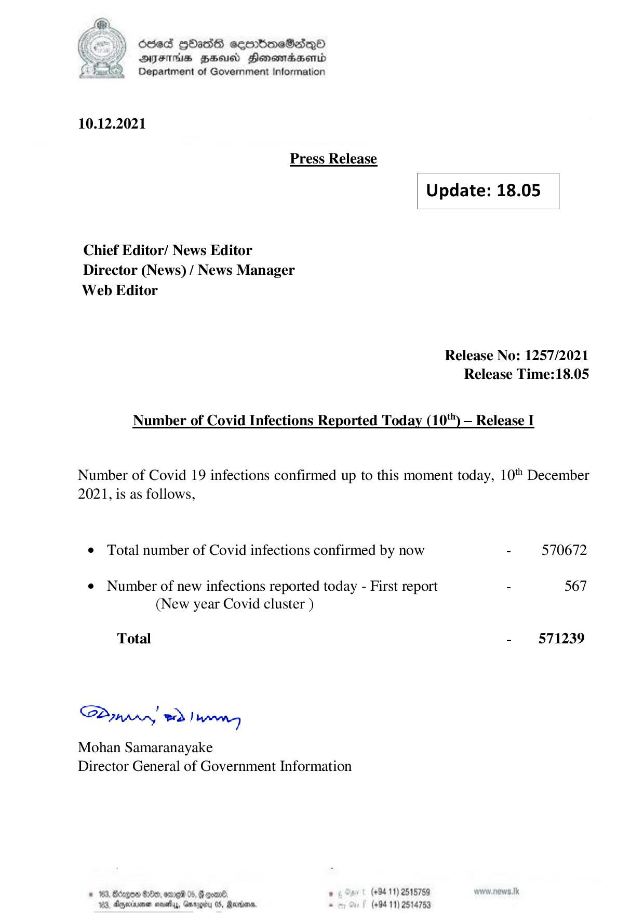

# Press Release - 2021.12.10 
Key: 87edb120b298905b76767c48620da1bc 

---
```
) dcded QhasS ceerbneSdiqQo
DFTs HH Honsomadsenid
Department of Government Information

 

 

10.12.2021
Press Release
Update: 18.05
Chief Editor/ News Editor
Director (News) / News Manager
Web Editor

Release No: 1257/2021
Release Time:18.05

Number of Covid Infections Reported Today (10) — Release I

Number of Covid 19 infections confirmed up to this moment today, 10" December
2021, is as follows,

© Total number of Covid infections confirmed by now - 570672

¢ Number of new infections reported today - First report - 567
(New year Covid cluster )

- 571239

Total

Sa mprr wd! bong

Mohan Samaranayake
Director General of Government Information

(+94 11) 2515759
(+94 11) 2514753

 

© 163, Bdzgon Oe, ore 05, B coal.
163, Apexnener sevethys, Garogiry 0S, Rare,

```
