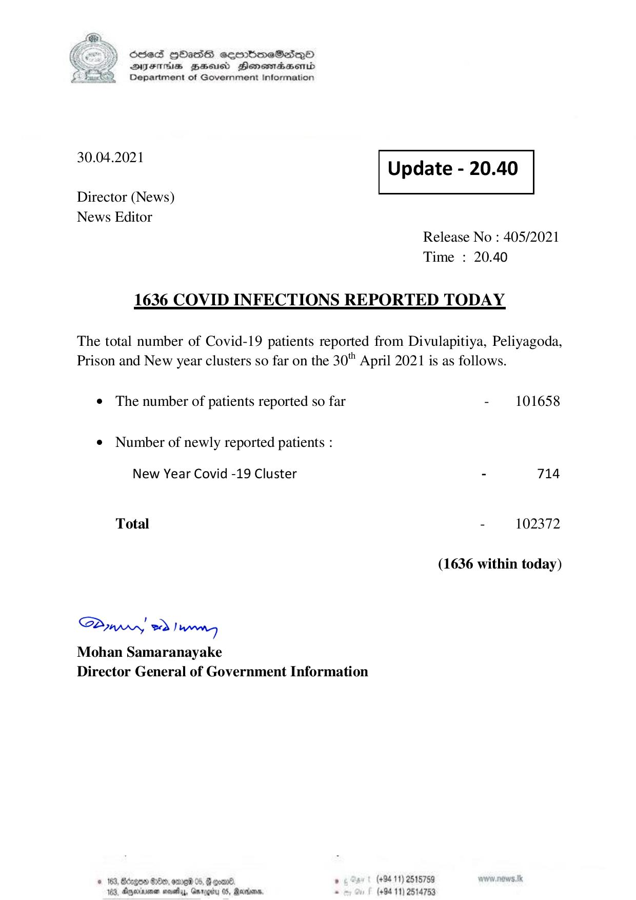

# Press Release - 2021.04.30 
Key: 88aaefe93f0064c22bc648b66ed1ffe8 

---
```
) ScdeS HOadS cermbmeSsdQo
SUES Zeid Henesrdaembd
Department of Government Information

 

 

30.04.2021 Update - 20.40

 

 

 

Director (News)
News Editor

Release No : 405/2021
Time : 20.40

1636 COVID INFECTIONS REPORTED TODAY

The total number of Covid-19 patients reported from Divulapitiya, Peliyagoda,
Prison and New year clusters so far on the 30" April 2021 is as follows.

¢ The number of patients reported so far - 101658

¢ Number of newly reported patients :

New Year Covid -19 Cluster - 714
Total - 102372
(1636 within today)

Saw 2) wn
Mohan Samaranayake
Director General of Government Information

© 163, Bdegom G8, ome 05, gone . (+94 11) 2518759
183, Aneruene seehy, argu 05, Rares. - (+94 11) 2514753

```
