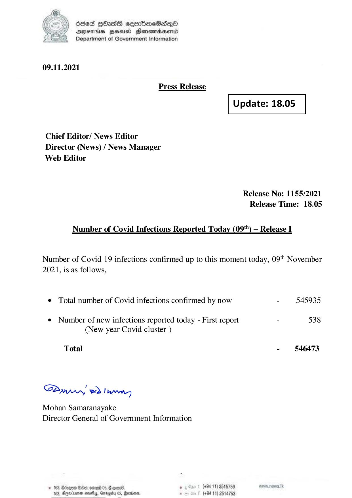

# Press Release - 2021.11.09 
Key: 89492f73952d1750da2715fe7314d162 

---
```
) dcded QOadS seenBboeSiqQo
AIFS HHUCO Honemadaenrd
Department of Government Information

 

09.11.2021

Press Release

 

 

Update: 18.05

 

 

Chief Editor/ News Editor
Director (News) / News Manager
Web Editor

Release No: 1155/2021
Release Time: 18.05

Number of Covid Infections Reported Today (09") — Release I

Number of Covid 19 infections confirmed up to this moment today, 09" November
2021, is as follows,

e Total number of Covid infections confirmed by now - 545935

¢ Number of new infections reported today - First report - 538
(New year Covid cluster )

Total - 546473

SPynpry wd! hawny

Mohan Samaranayake
Director General of Government Information

 

© 163, Bccgen 6:8, erg 05, @ eoene ; (+94 11) 2515789

163, Apexnener sevethys, Garogiry 0S, Rare, - (+94 11) 2514753

```
