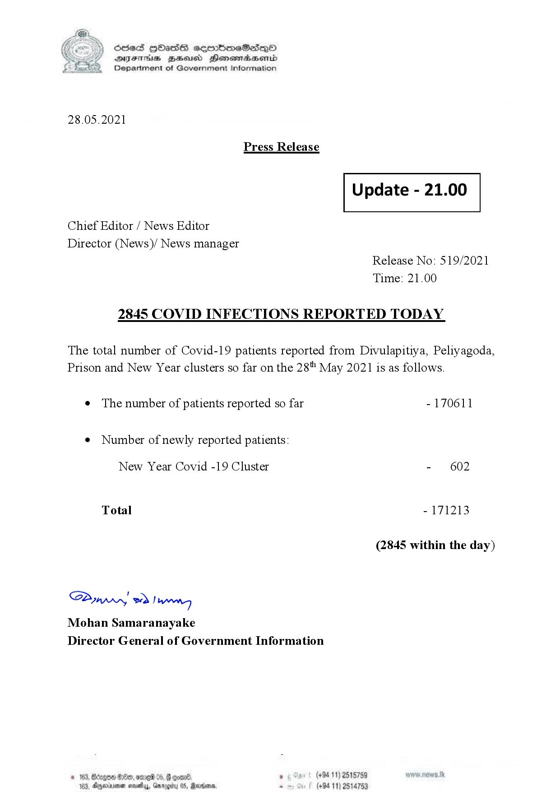

# Press Release - 2021.05.28 - Covid 19 infection report 
Key: 89600c95198839635853007efde15118 

---
```
(6 S) ScseS HOasdS cerrbmeSdQo
DFTs BHEosd Henewtaeasernid
Department of Government Information

 

28.05.2021

Press Release

 

Update - 21.00

 

 

 

Chief Editor / News Editor

Director (News)/ News manager
Release No: 519/2021
Time: 21.00

2845 COVID INFECTIONS REPORTED TODAY

The total number of Covid-19 patients reported from Divulapitiya, Peliyagoda,
Prison and New Year clusters so far on the 28" May 2021 is as follows.

e The number of patients reported so far - 170611

¢ Number of newly reported patients:

New Year Covid -19 Cluster - 602
Total - 171213
(2845 within the day)

Saw 2) wong
Mohan Samaranayake
Director General of Government Information

 

* 163 Oe, ome 05, F qoav8 , (+94 11) 2515759
2. Apminmen nay, Gameby 05, Rarer * (+94 11) 2514753

```
