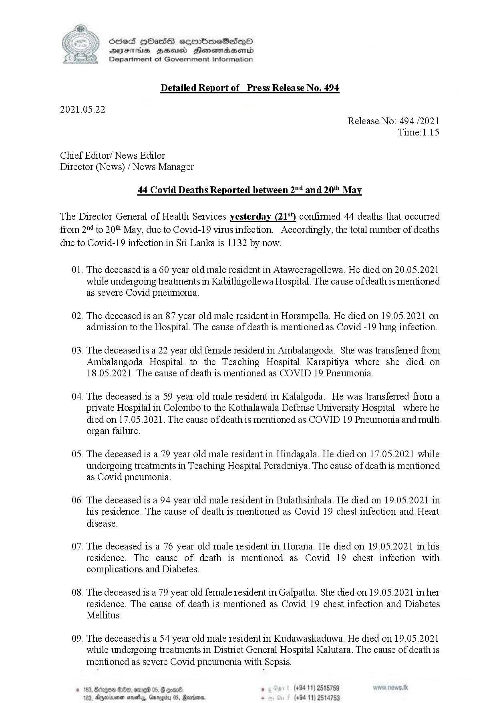

# Press Release - 2021.05.22 - 44 Covid Deaths Reported between 2nd and 20th May 
Key: 89a8bd2151908b8895f1305d26d3553f 

---
```
 

Sed Hbass seembmeSese—p©O
DIF BHusd Henemadaenrd
Department of Government Information

Detailed Report of Press Release No. 494

2021.05.22

Release No: 494 /2021
Time:1.15

Chief Editor/ News Editor
Director (News) / News Manager

44 Covid Deaths Reported between 2" and 20 May

The Director General of Health Services yesterday (21%) confirmed 44 deaths that occurred
from 2" to 20 May, due to Covid-19 virus infection. Accordingly, the total number of deaths
due to Covid-19 infection in Si Lanka is 1132 by now.

Ol.

02.

03.

04.

05.

06.

07.

08.

09.

 

The deceased is a 60 year old male resident in Ataweeragollewa. He died on 20.05.2021
while undergoing treatments in Kabithigollewa Hospital. The cause of death is mentioned
as severe Covid pneumonia.

The deceased is an 87 year old male resident in Horampella. He died on 19.05.2021 on
admission to the Hospital. The cause of death is mentioned as Covid -19 lung infection.

The deceased is a 22 year old female resident in Ambalangoda. She was transferred from
Ambalangoda Hospital to the Teaching Hospital Karapitiya where she died on
18.05.2021. The cause of death is mentioned as COVID 19 Pneumonia.

The deceased is a 59 year old male resident in Kalalgoda. He was transferred from a
private Hospital in Colombo to the Kothalawala Defense University Hospital where he
died on 17.05.2021. The cause of death is mentioned as COVID 19 Pneumonia and multi
organ failure.

The deceased is a 79 year old male resident in Hindagala. He died on 17.05.2021 while
undergoing treatments in Teaching Hospital Peradeniya. The cause of death is mentioned
as Covid pneumonia.

The deceased is a 94 year old male resident in Bulathsinhala. He died on 19.05.2021 in
his residence. The cause of death is mentioned as Covid 19 chest infection and Heart
disease.

The deceased is a 76 year old male resident in Horana. He died on 19.05.2021 in his
residence. The cause of death is mentioned as Covid 19 chest infection with
complications and Diabetes.

The deceased is a 79 year old female resident in Galpatha. She died on 19.05.2021 in her
residence. The cause of death is mentioned as Covid 19 chest infection and Diabetes
Mellitus.

The deceased is a 54 year old male resident in Kudawaskaduwa. He died on 19.05.2021
while undergoing treatments in District General Hospital Kalutara. The cause of death is
mentioned as severe Covid pneumonia with Sepsis.

, (+94 11) 2515789
(+94 11) 2514753

```
