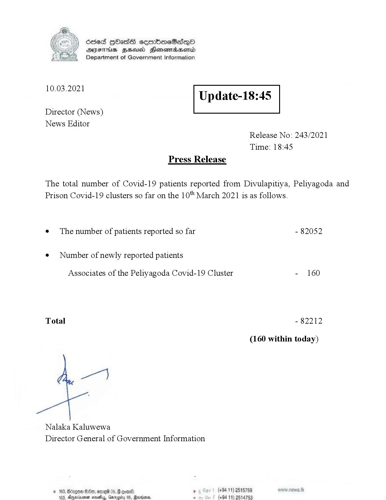

# Press Release - 2021.03.10 
Key: 8a2ce69b9e9c5df73d8f991a46508120 

---
```
Ssed HbasG sembmeSadqo
DAIS BHU Honomasentd
Department of Government Information

 

 

10.03.2021

Update-18:45

 

 

 

Director (News)
News Editor
Release No: 243/2021
Time: 18:45
Press Release

The total number of Covid-19 patients reported from Divulapitiya, Peliyagoda and
Prison Covid-19 clusters so far on the 10" March 2021 is as follows.
e¢ The number of patients reported so far - 82052

¢ Number of newly reported patients

Associates of the Peliyagoda Covid-19 Cluster - 160

Total - 82212

(160 within today)

Nalaka Kaluwewa
Director General of Government Information

é . (+94 11) 2515759
, Rares. . (+94 11) 2514753

  

© 163, Bdegow 88e0, ome 0
183, Anema nasty, Gar

```
