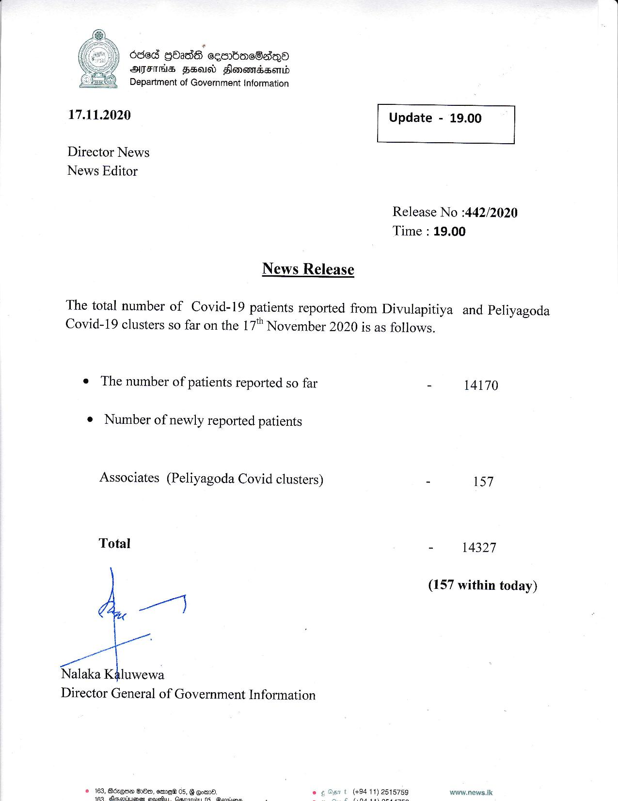

# Press Release - 2020.11.17 
Key: 8a65dda078ffd61247b195646543274e 

---
```
  

| dsed QOadS ecobmeSaeno
AFIS FEO Slomemndssenid
Department of Government Information

17.11.2020

Director News
News Editor

News Release

 

 

Update - 19.00

 

 

Release No :442/2020
Time : 19.00

The total number of Covid-19 patients reported from Divulapitiya and Peliyagoda
Covid-19 clusters so far on the 17 November 2020 is as follows.

e The number of patients reported so far

e Number of newly reported patients

Associates (Peliyagoda Covid clusters)

Total

ay

Nalaka Kaluwewa
Director General of Government Information

© 163, Aczgne DH, emee 0s,
Gh iteatb van maces tice

 

 

 

- 14170

- 157

- 14327

(157 within today)

wwaw.news.ik

```
