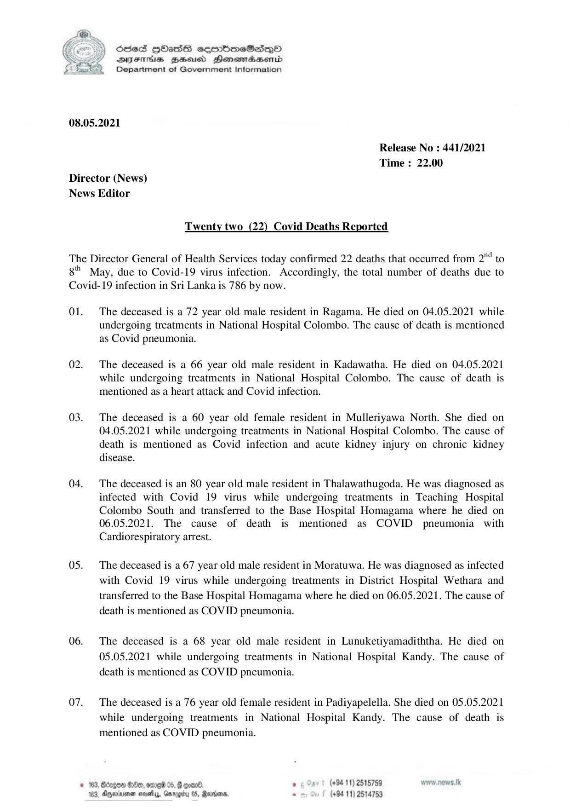

# Press Release - 2021.05.08 - Covid 19 Infection deaths 
Key: 8b55f7d3de6af78f02c318f13b47cc29 

---
```
 

6856S HHass sermbmeSasqo
DFTs BHEosd Henewtaeasernid
Department of Government Information

08.05.2021

Release No : 441/2021
Time : 22.00

Director (News)
News Editor

Twenty two (22) Covid Deaths Reported

The Director General of Health Services today confirmed 22 deaths that occurred from 2" to

gt

May, due to Covid-19 virus infection. Accordingly, the total number of deaths due to

Covid-19 infection in Sri Lanka is 786 by now.

Ol.

02.

03.

04.

05.

06.

07.

The deceased is a 72 year old male resident in Ragama. He died on 04.05.2021 while
undergoing treatments in National Hospital Colombo. The cause of death is mentioned
as Covid pneumonia.

The deceased is a 66 year old male resident in Kadawatha. He died on 04.05.2021
while undergoing treatments in National Hospital Colombo. The cause of death is
mentioned as a heart attack and Covid infection.

The deceased is a 60 year old female resident in Mulleriyawa North. She died on
04.05.2021 while undergoing treatments in National Hospital Colombo. The cause of
death is mentioned as Covid infection and acute kidney injury on chronic kidney
disease.

The deceased is an 80 year old male resident in Thalawathugoda. He was diagnosed as
infected with Covid 19 virus while undergoing treatments in Teaching Hospital
Colombo South and transferred to the Base Hospital Homagama where he died on
06.05.2021. The cause of death is mentioned as COVID pneumonia with
Cardiorespiratory arrest.

The deceased is a 67 year old male resident in Moratuwa. He was diagnosed as infected
with Covid 19 virus while undergoing treatments in District Hospital Wethara and
transferred to the Base Hospital Homagama where he died on 06.05.2021. The cause of
death is mentioned as COVID pneumonia.

The deceased is a 68 year old male resident in Lunuketiyamadiththa. He died on
05.05.2021 while undergoing treatments in National Hospital Kandy. The cause of
death is mentioned as COVID pneumonia.

The deceased is a 76 year old female resident in Padiyapelella. She died on 05.05.2021
while undergoing treatments in National Hospital Kandy. The cause of death is
mentioned as COVID pneumonia.

© 163, Bdngon $0, ome 05, G coand. . (+94 11) 2515759 wow .nows.tk

103, Ayexrne masety, Gurogiy 05, Rerdans, - (+94 11) 2514753

```
