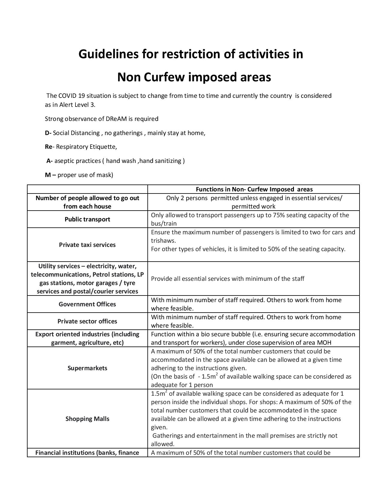

# Press Release - 2020.11.02 - Guidelines for restriction of activities in Non Curfew imposed areas 
Key: 8b9d372bda6fffa279830e0c71b27bef 

---
```
Guidelines for restriction of activities in

Non Curfew imposed areas

The COVID 19 situation is subject to change from time to time and currently the country is considered
as in Alert Level 3.

Strong observance of DReAM is required

D- Social Distancing , no gatherings , mainly stay at home,
Re- Respiratory Etiquette,

A- aseptic practices ( hand wash ,hand sanitizing )

M -— proper use of mask)

CF Functions in Non. Curfew Imposed areas

Number of people allowed to go out Only 2 persons permitted unless engaged in essential services/
from each house permitted work

Only allowed to transport passengers up to 75% seating capacity of the

bus/train

Ensure the maximum number of passengers is limited to two for cars and

trishaws.

For other types of vehicles, it is limited to 50% of the seating capacity.

Public transport

Private taxi services

 

```
