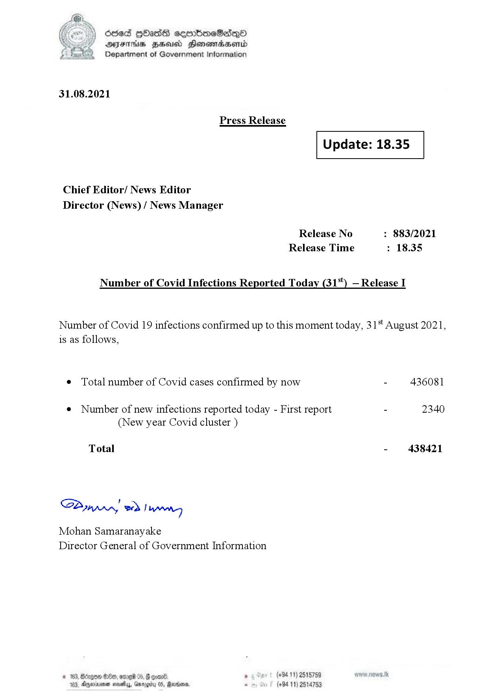

# Press Release - 2021.08.31 
Key: 8cb6efc391869ed2ff085d71dea7a073 

---
```
(2) Oded QOasS cseenboeSiqQo
DFS HHS Honsmnadaerntd
Department of Government Information

 

31.08.2021

Press Release

 

Update: 18.35

 

 

 

Chief Editor/ News Editor
Director (News) / News Manager

Release No : 883/2021
Release Time : 18.35

Number of Covid Infections Reported Today (31%) — Release I

Number of Covid 19 infections confirmed up to this moment today, 31 August 2021,
is as follows,

e Total number of Covid cases confirmed by now - 436081

¢ Number of new infections reported today - First report - 2340
(New year Covid cluster )

Total - 438421

SB, eed | Hrs

Mohan Samaranayake
Director General of Government Information

° 16 @00, ome 05, # con®. ° (+94 11) 2515759
183, Dyevinenan novels, Garogity 0 (+94 11) 2514753

 

```
