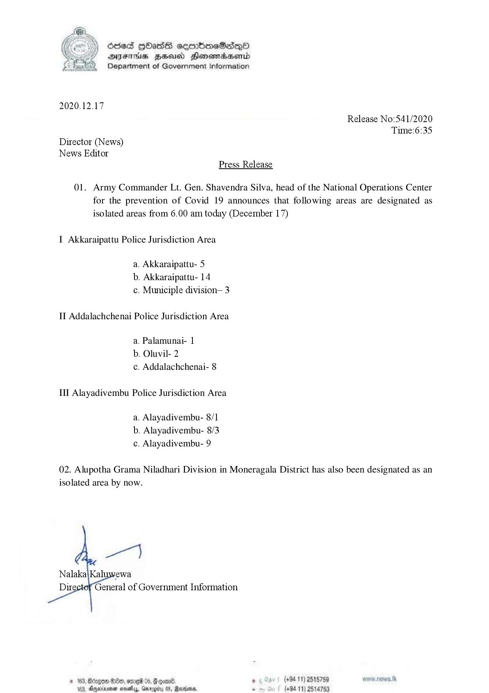

# Press Release - 2020.12.17 - Newly isolates Areas 
Key: 8cb90b0b8ef5a345bb5e893928a261ce 

---
```
oes HHass sembmeSasqQnd
DFS HHsusd Honsmadawentd
Department of Government Information

 

2020.12.17
Release No:541/2020
Tume:6:35
Director (News)
News Editor
Press Release

01. Army Commander Lt. Gen. Shavendra Silva, head of the National Operations Center
for the prevention of Covid 19 announces that following areas are designated as
isolated areas from 6.00 am today (December 17)

I Akkaraipattu Police Jurisdiction Area

a. Akkaraipattu- 5
b. Akkaraipattu- 14
c. Municiple division— 3

II Addalachchenai Police Jurisdiction Area
a. Palamunai- |

b. Oluvil- 2
c. Addalachchenai- 8

Ill Alayadivembu Police Jurisdiction Area

a. Alayadivembu- 8/1
b. Alayadivembu- 8/3
c. Alayadivembu- 9

02. Alupotha Grama Niladhari Division in Moneragala District has also been designated as an
isolated area by now.

  

rewa
General of Government Information

# 168, Bcrgon $80, mre 05, Govan. » 5 Ser! (48411) 2515789 www news. tk
184, Onjwiayenen ces, Gmregibr 05, Rendon. . (694-11) 2514753

```
