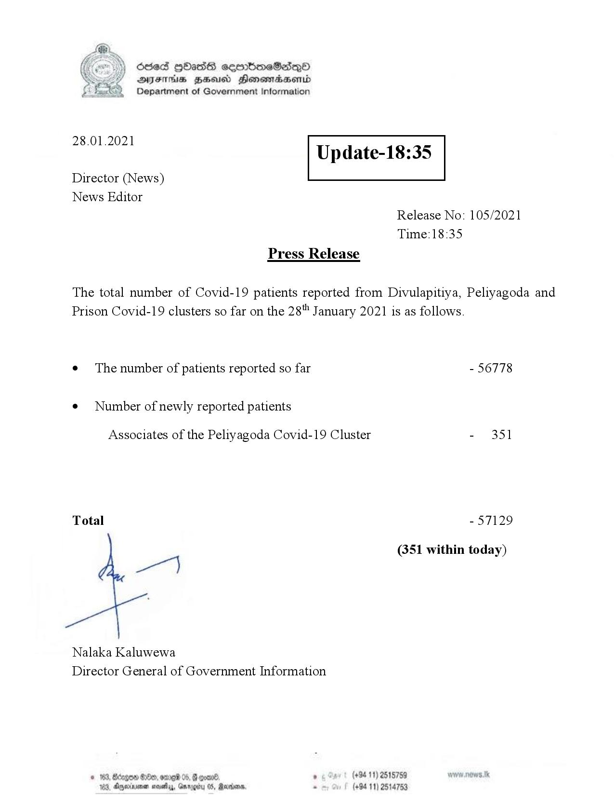

# Press Release - 2021.01.28 
Key: 8cc5c1b7418933667726a9929fb14a0b 

---
```
Ssed HbasG sembmeSadqo
DAIS BHU Honomasentd
Department of Government Information

 

 

28.01.2021

Update-18:35

 

 

 

Director (News)
News Editor
Release No: 105/2021
Time:18:35
Press Release

The total number of Covid-19 patients reported from Divulapitiya, Peliyagoda and
Prison Covid-19 clusters so far on the 28" January 2021 is as follows.
e¢ The number of patients reported so far - 56778

¢ Number of newly reported patients

Associates of the Peliyagoda Covid-19 Cluster - 351

Total - 57129

(351 within today)

Nalaka Kaluwewa
Director General of Government Information

° (+94 11) 2515759
(+94 11) 2514753

© 163, Bdegon G0e, ome 05, G com
188, Agjerinenen mosetay, Garp

  

```
