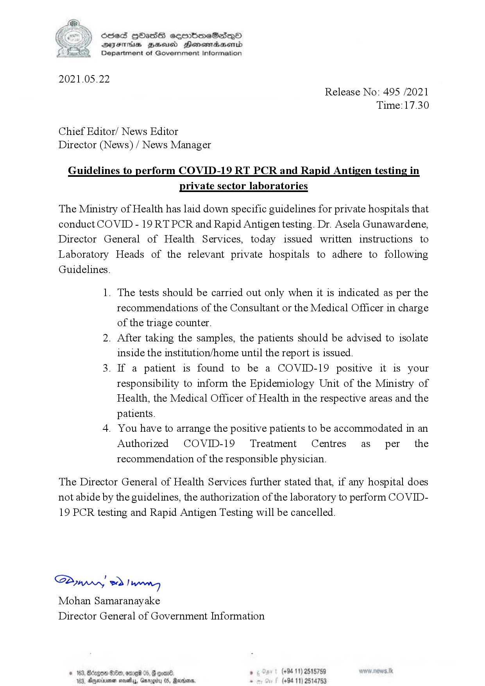

# Press Release - 2021.05.22 - Guidelines to perform Covid 19 RT PCR and Rapid Antigen testing in private sector laboratories 
Key: 8ceda0bd924343de70b7fc4cfb689262 

---
```
(eee ) ScteS HOass sermbmeSisqQo

 

2021.05.22

DIFIHs BHHEsusd Honewtadasernid
Department of Government Information

Release No: 495 /2021
Time: 17.30

Chief Editor/ News Editor
Director (News) / News Manager

Guidelines to perform COVID-19 RT PCR and Rapid Antigen testing in

private sector laboratories

The Ministry of Health has laid down specific guidelines for private hospitals that
conduct COVID - 19 RT PCR and Rapid Antigen testing. Dr. Asela Gunawardene,
Director General of Health Services, today issued written instructions to

Laboratory Heads of the relevant private hospitals to adhere to following

Guidelines.

1.

The tests should be carried out only when it is indicated as per the
recommendations of the Consultant or the Medical Officer in charge
of the triage counter.

. After taking the samples, the patients should be advised to isolate

inside the institution/home until the report is issued.

If a patient is found to be a COVID-19 positive it is your
responsibility to inform the Epidemiology Unit of the Ministry of
Health, the Medical Officer of Health in the respective areas and the
patients.

You have to arrange the positive patients to be accommodated in an
Authorized COVID-19 Treatment Centres as per the
recommendation of the responsible physician.

The Director General of Health Services further stated that, if any hospital does
not abide by the guidelines, the authorization of the laboratory to perform COVID-
19 PCR testing and Rapid Antigen Testing will be cancelled.

S207 Inn
Mohan Samaranayake

Director General of Government Information

 

200, ODED 05, F come
103, Dnexienen novelas, Gar

, (+94 11) 2515759
(+94 11) 2514753

 

```
