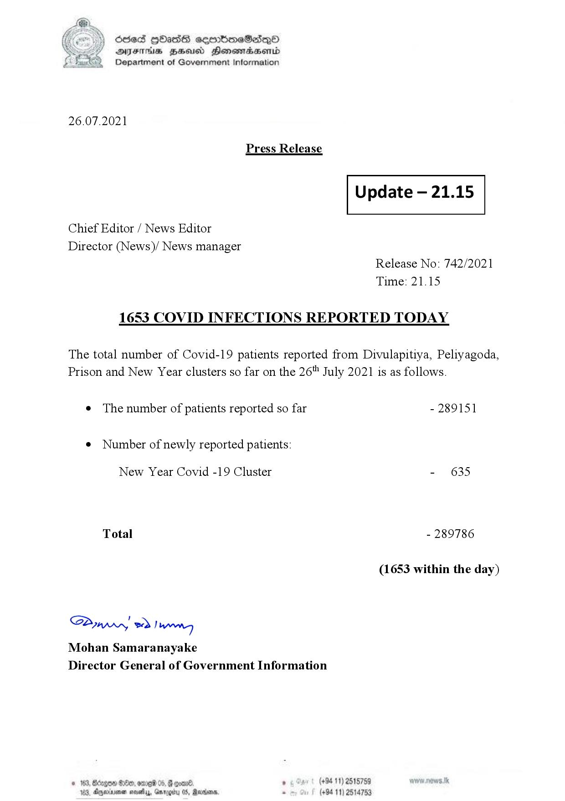

# Press Release - 2021.07.26 - Covid 19 Infection Report 
Key: 8dbee02a4db412ce1adc8fabb504f516 

---
```
)) Sed HOads seembmeSadQo
Y AYsTH1s BHeusd Henemradasenrd
(©) Department of Government Information

 

26.07.2021

Press Release

 

Update — 21.15

 

 

 

Chief Editor / News Editor
Director (News)/ News manager
Release No: 742/2021
Time: 21.15
1653 COVID INFECTIONS REPORTED TODAY

The total number of Covid-19 patients reported from Divulapitiya, Peliyagoda,
Prison and New Year clusters so far on the 26" July 2021 is as follows.

e The number of patients reported so far - 289151

¢ Number of newly reported patients:

New Year Covid -19 Cluster - 635
Total - 289786
(1653 within the day)

Saw 2) won,
Mohan Samaranayake
Director General of Government Information

© 163, Bongo #200, ome 05, G goan® , (+94 11) 2518759
163, Agere naethy, Gmrogiby 05, Rereisons, - (+94 11) 2514753

```
