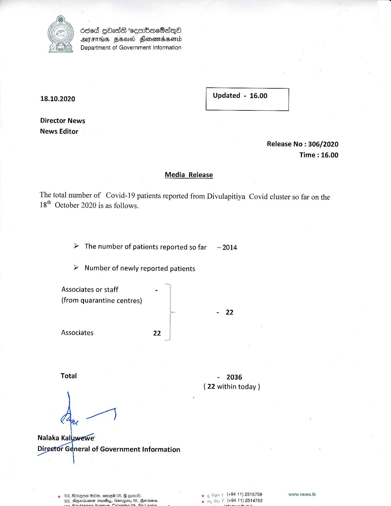

# Press Release - 2020.10.18 
Key: 8dfea8240d8f7b80a5ad3e2e8b231a7d 

---
```
6865 GOadS "eesibacOa~QoO
HITS HBA Hlomenrdserd
Department of Government Information

 

 

18.10.2020 Updated - 16.00

 

 

 

Director News
News Editor

Media Release

Release No : 306/2020

Time : 16.00

The total number of Covid-19 patients reported from Divulapitiya Covid cluster so far on the

18" October 2020 is as follows.

» The number of patients reported so far —2014

» Number of newly reported patients

Associates or staff -
(from quarantine centres)

Associates 22

Total - 2036
( 22 within today )

   

ir General of Government Information

(+94 11) 2515759
14753

    

wwew.news.Ik

```
