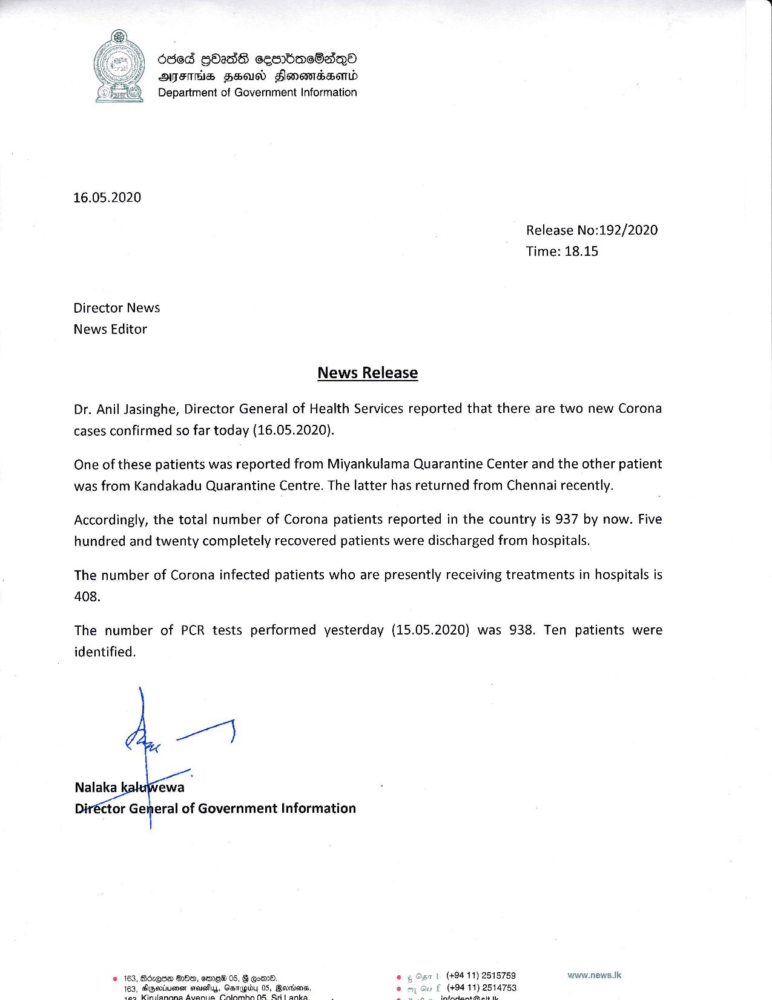

# Press Release - 2020.05.16 - 2 new corona cases have been confirmed today 
Key: 8ee813e8da77a48427d573e2cb6543f9 

---
```
686d GOadS cembachaQea
AIFS HSU Slonevidssenld
Department of Government Information

 

16.05.2020

Release No:192/2020
Time: 18.15

Director News
News Editor
News Release

Dr. Anil Jasinghe, Director General of Health Services reported that there are two new Corona
cases confirmed so far today (16.05.2020).

One of these patients was reported from Miyankulama Quarantine Center and the other patient
was from Kandakadu Quarantine Centre. The latter has returned from Chennai recently.

Accordingly, the total number of Corona patients reported in the country is 937 by now. Five
hundred and twenty completely recovered patients were discharged from hospitals.

The number of Corona infected patients who are presently receiving treatments in hospitals is
408.

The number of PCR tests performed yesterday (15.05.2020) was 938. Ten patients were
identified.

  
   

Nalaka
iréctor General of Government Information

| (494 11) 2515759 www.news.1k

     
 

```
