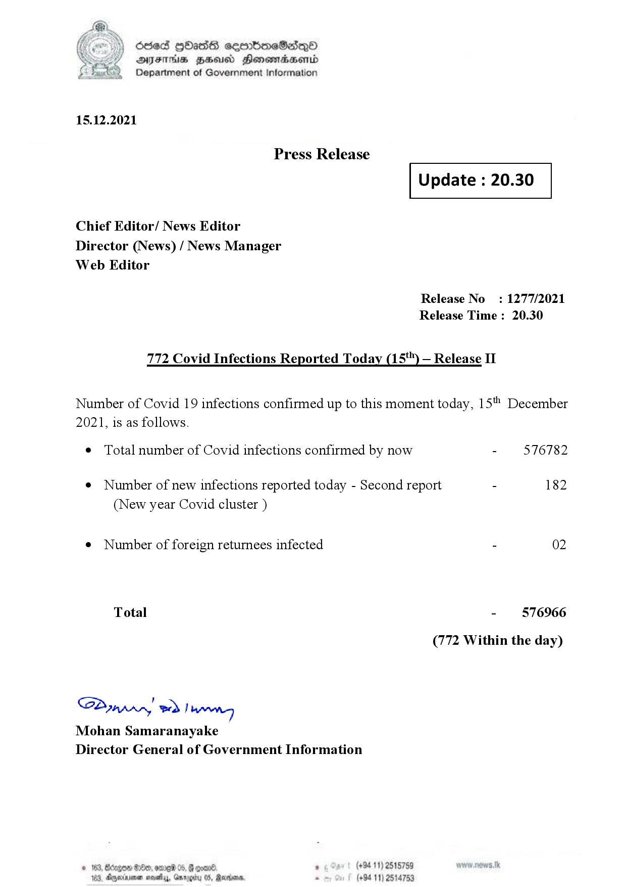

# Press Release - 2021.12.15 - Covid 19 Infection Report 
Key: 8f3132a67f2f22518cc4fa3e82d2f068 

---
```
dosed GOass eemmbmeSadepO
DFS BHU Honswnradasentd
Department of Government Information

 

 

15.12.2021

Press Release

 

Update : 20.30

 

 

 

Chief Editor/ News Editor
Director (News) / News Manager
Web Editor

Release No: 1277/2021
Release Time : 20.30

772 Covid Infections Reported Today (15*") — Release II

Number of Covid 19 infections confirmed up to this moment today, 15" December
2021, is as follows.

¢ Total number of Covid infections confirmed by now - 576782

¢ Number of new infections reported today - Second report - 182
(New year Covid cluster )

¢ Number of foreign returnees infected - 02

Total - 576966
(772 Within the day)

SP nprrn wd Ianwng
Mohan Samaranayake
Director General of Government Information

(+94 11) 2515759
(+94 11) 2514753

GOD 100, omg 05
Doyerinsonen snevetyy, Garo

   

```
