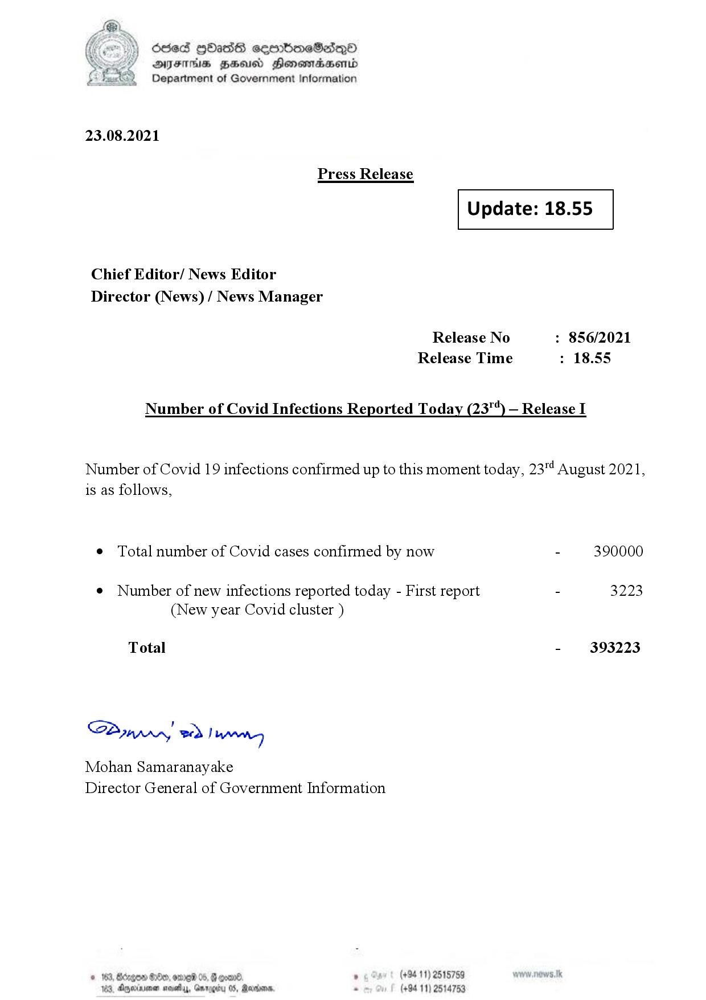

# Press Release - 2021.08.23 
Key: 8f8a920777b8f85468722e498abefcb3 

---
```
(2) Oded QOasS cseenboeSiqQo
DFS HHS Honsmnadaerntd
Department of Government Information

 

23.08.2021

Press Release

 

Update: 18.55

 

 

 

Chief Editor/ News Editor
Director (News) / News Manager

Release No : 856/2021
Release Time : 18.55

Number of Covid Infections Reported Today (23") — Release I

Number of Covid 19 infections confirmed up to this moment today, 23" August 2021,
is as follows,

¢ Total number of Covid cases confirmed by now - 390000

¢ Number of new infections reported today - First report - 3223
(New year Covid cluster )

Total - 393223

SB, eed | Mens

Mohan Samaranayake
Director General of Government Information

   

188, Anexivenan noes, Garogiy 05, Mardoorn,

```
